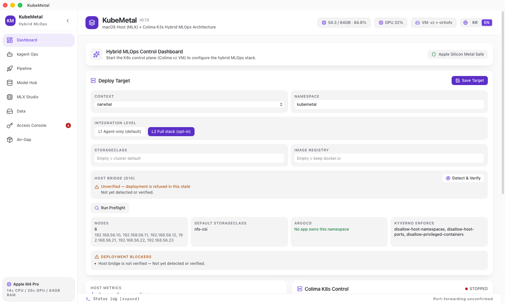

# KubeMetal

**English** | [한국어](README-ko.md)



An Apple Silicon-only hybrid MLOps desktop app — unifying a standard Kubernetes control
plane and native macOS host MLX compute into a single Tauri v2 (Rust) + React/TypeScript app.

## Core Concept: Control/Compute Separation

KubeMetal **physically separates Control and Compute**. The current verified/default path
runs the MLOps control plane — MLflow, SeaweedFS — as pods inside a lightweight K3s cluster
on Colima (`vz` + `virtiofs`), while MLX fine-tuning and serving run directly as
**macOS host processes** spawned by the Tauri/Rust backend.

This separation remains the production/default architecture because MLX is a native
Apple Silicon/macOS runtime and KubeMetal does not assume that an MLX workload can run
inside a Linux guest or K8s pod.

Colima 0.10+ also provides a `krunkit` VM path for GPU-accelerated containers on Apple
Silicon. KubeMetal treats that path as an **experimental compute backend candidate**, not
as proof of Kubernetes accelerator support. GPU access from a VM/container does not by
itself prove that K3s can discover, allocate, schedule, isolate, or account for the GPU as
a Kubernetes resource. That boundary is tracked by
[#94 — Colima krunkit GPU Container / K3s Scheduling Feasibility](https://github.com/dasomel/kubemetal/issues/94).

This hybrid structure lets KubeMetal keep a reliable local-first MLX path while leaving a
measured path toward additional local container runtimes and remote GPU/NPU Kubernetes
backends.

## Compute Backend Direction

KubeMetal is evolving toward an explicit `ComputeBackend` contract rather than assuming
that every AI workload must execute through one runtime.

| Backend | Role | Status |
|---|---|---|
| `host-mlx` | Native macOS MLX fine-tuning / serving | **Default / verified** |
| `host-cumetal` | CUDA-compatibility experiments on Apple Silicon | **Experimental** — see #84 |
| `krunkit-container` | Colima/krunkit GPU-container path | **Experimental / unverified for K3s scheduling** — see #94 |
| `remote-kubernetes` | Remote NVIDIA/NPU/accelerator cluster | **Extension path** |

The intended separation is:

```text
Request / Agent
      |
      v
Policy + Routing
      |
      v
ComputeBackend
  +-- host-mlx             [default]
  +-- host-cumetal         [experimental]
  +-- krunkit-container    [experimental]
  +-- remote-kubernetes    [extension]
      |
      v
Execution Evidence / Observability
```

Backend selection must remain policy- and capability-aware. In particular, DRA/Kueue are
not assumed for the local Apple GPU path; they only become relevant after a real
Kubernetes-manageable accelerator resource has been demonstrated.

## Requirements

- macOS 14+ (Apple Silicon)
- Homebrew
- colima, kubectl — `brew install colima kubectl`
- optional experimental runtime dependencies are documented and gated per backend; `krunkit` is not required for the default `vz` + host MLX path
- Node 22+ / pnpm
- Rust (rustup)

## App Layout — 8 Tabs

| Tab | Role |
|----|------|
| **Dashboard** | Real-time RAM/CPU monitoring, one-click start/stop of the Colima (vz) K8s cluster, MLOps stack provisioning, port-forward control |
| **kagent Ops** | Cluster AIOps — per-context kagent diagnostics, toggling AI agents (security / promql / observability) on and off, kagent UI (8090) connection. The default integration path for external clusters (D30 L1) |
| **Pipeline** | Visualizes stage-by-stage status as cards, from cluster startup → provisioning → model download → fine-tuning → MLflow registration → serving |
| **Model Hub** | One-click flow from Hugging Face model search → host download → SeaweedFS S3 upload → MLflow Model Registry registration, plus a list of registered models |
| **MLX Studio** | Installs the host MLX venv environment, runs LoRA fine-tuning on local models (real-time progress/loss display), starts/stops model serving via `mlx_lm.server` |
| **Data** | Data ingestion DAG pipeline (web/file/HF → chunking → LanceDB RAG → SeaweedFS S3 backup), DVC dataset version management |
| **Access Console** | Credential-free one-click access to provisioned services such as MLflow / SeaweedFS Filer, health status lookup |
| **Air-Gap Management** | Download and offline install of an offline bundle (images, charts, binaries) for air-gapped networks, asset version verification |

## How to Run

1. Install dependencies
   ```bash
   pnpm install
   ```
2. Run in dev mode — the vite dev server auto-starts via `beforeDevCommand`.
   ```bash
   pnpm tauri dev
   ```
3. Pressing the **Start Cluster** button on the **Dashboard** tab internally runs the
   following command with CPU/memory values auto-derived from detected host RAM.
   ```bash
   colima start --cpu <N> --memory <M> --vm-type=vz --mount-type=virtiofs --kubernetes
   ```
4. Press **Provision MLOps Stack** to apply the MLflow / SeaweedFS (+ credential Secret) /
   mac-gpu-bridge manifests to the cluster.
5. Press **Start Port Forwarding** to reach the following addresses.
   - MLflow: http://localhost:5001
   - SeaweedFS S3 API: http://localhost:8333
   - SeaweedFS Filer UI: http://localhost:8888
6. Download a model in the **Model Hub** tab and run fine-tuning/serving in the **MLX
   Studio** tab. The overall flow can be tracked in the **Pipeline** tab, and service
   access can be checked in the **Access Console** tab.

## Connecting an External Cluster (D30 — default: agent-only)

The default integration for an existing cluster is to **install the agent only**. The
MLOps stack stays on its own k3s (Colima); the external cluster is connected purely as an
observation/diagnostics/ops target (no bridge).

```bash
make kagent-up CONTEXT=<kubeconfig-context>   # kagent 0.9.12 helm install (kagent ns)
```

From there, use the app's **kagent Ops tab** for per-context diagnostics lookups and to
toggle agents (security/promql/observability) on and off. The kagent UI opens on 8090 via
`make forward`. This path has been verified on a real production 6-node K3s HA cluster
(narwhal) — preflight checks and kagent diagnostics lookups confirmed in-app, measured on
device, from a signed packaged app (2026-07-30).
LAN cluster access from the packaged app requires a stable code-signing identity — if a
valid codesigning identity exists in the keychain, `make app` signs automatically with it
(see the D26 section below).

## Deploying to an Existing Cluster (D26 — opt-in)

> The **default integration for external clusters is agent-only** (D30) — the stack stays
> on its own k3s, and installing only the kagent agent on the external cluster is the
> default path. The full-stack deployment below is an advanced, opt-in path to be chosen
> explicitly after confirming its prerequisites (terminal access, mirror registry, ArgoCD
> boundaries).

You can bring up the MLOps stack on an **existing Kubernetes cluster** without spinning up
a new Colima instance. The deployment target is specified via a kubeconfig context, and
external clusters use a dedicated `kubemetal` namespace instead of `default`.

1. Preflight check — confirms, on device, reachability, the default StorageClass, the
   ArgoCD Application owning the target namespace, Kyverno Enforce policies, and host
   bridge candidates.
   ```bash
   make preflight CONTEXT=<context> NAMESPACE=kubemetal
   ```
2. Confirm the render — view the result without applying it.
   ```bash
   make render CONTEXT=<context> BRIDGE_HOST=<host-IP> STORAGE_CLASS=<SC>
   ```
   `BRIDGE_HOST` must be an address **whose reachability was actually verified among the
   candidates from step 1**. Omitting it causes the render to be refused — otherwise the
   Colima-only address would be carried through as-is and pods would die silently.
3. Apply
   ```bash
   make provision CONTEXT=<context> BRIDGE_HOST=<host-IP> STORAGE_CLASS=<SC>
   ```

This full-stack path has been verified, measured on device, on the same 6-node cluster
against a Kyverno Enforce policy, a private mirror registry (working around Docker Hub
pull limits), and an ArgoCD GitOps environment (selfHeal boundary, D27) (2026-07-26,
terminal access). The observation that this onboarding cost repeats proportionally to the
number of clusters is the basis for D30 (agent-only by default).

> ℹ️ **A signed build is required.** With ad-hoc signing (whose identifier changes on every
> build), macOS local network permission is not pinned, and LAN kubectl is blocked with
> `no route to host`. If a valid codesigning identity exists in the keychain, `make app`
> signs automatically with it (a self-signed certificate is sufficient — limited to this
> Mac, measured on device 2026-07-29). For distribution to others, use a Developer ID:
> `make app SIGNING_IDENTITY="Developer ID Application: …"`.
> See the 2026-07-27 entry in `docs/mistakes-log.md` for details.

**If you need an internal registry/mirror**, append `IMAGE_REGISTRY=<host[/project]>` to
redirect Docker Hub images there (for air-gapped networks, or clusters hitting Docker Hub
anonymous pull limits).

**If ArgoCD owns the target namespace**, a direct apply will be reverted by selfHeal. Use
the GitOps path instead (D27) — kubemetal only writes files locally and does not push to
Gitea.
```bash
make export-gitops NARWHAL_DIR=/path/to/narwhal CONTEXT=<context> BRIDGE_HOST=<host-IP>
```

### Troubleshooting (checking directly via CLI)

```bash
colima status --json
kubectl --context colima get pods -n default
# external cluster
kubectl --context <context> get pods -n kubemetal
```

## Build / Packaging

```bash
pnpm tauri build   # produces .app / .dmg bundle (unsigned local build)
```

Output: `src-tauri/target/release/bundle/macos/KubeMetal.app`,
`src-tauri/target/release/bundle/dmg/KubeMetal_0.1.0_aarch64.dmg`

> In a non-GUI (headless) shell session, the `.dmg` creation step can hang on the
> AppleScript used for Finder icon placement (there is no GUI session to respond to the
> Automation permission prompt). In that case, running
> `src-tauri/target/release/bundle/dmg/bundle_dmg.sh` directly with the `--sandbox-safe`
> option skips the Finder decoration step and produces the same `.dmg`.

## License & Third-Party Notices

KubeMetal is Apache-2.0 licensed — see [LICENSE](LICENSE). Third-party
attribution splits across three files:

| File | Covers | When generated |
|------|--------|------|
| [NOTICE](NOTICE) | Orchestrated components (Colima, K3s, kagent, MLflow, SeaweedFS, Prefect, MLX) — spawned or deployed at runtime, never bundled | Static, committed |
| `THIRD-PARTY-NOTICES.md` | Rust crates + npm packages compiled/bundled into the app | Release time, from `Cargo.lock`/`pnpm-lock.yaml` (`scripts/release/gen_third_party_notices.sh`) |
| `sbom-cyclonedx.json` / `sbom-spdx.json` | Machine-readable inventory of the same bundled dependency graph | Release time, via Trivy (`scripts/release/gen_sbom.sh`) |

The generated files ship inside the app zip; `--verify` is a CI staging gate, and only the
zip and manifest are GitHub Release assets. They are not committed, since a committed copy
drifts from the lockfile.

## Project Structure

```text
kubemetal/
├── src/               # Frontend (React + TypeScript + Tailwind)
├── src-tauri/         # Backend (Rust Native Control Agent)
├── scripts/k8s/       # MLflow / SeaweedFS(+credential Secret) / mac-gpu-bridge manifests
├── scripts/mlx/       # Host MLX fine-tuning wrapper (finetune_wrapper.py)
└── docs/              # Proposal · requirements · MVP design · architecture docs
```

## Documentation Guide

| Document | Contents |
|------|------|
| [docs/01-proposal.md](docs/01-proposal.md) (Korean) | Project proposal — problem definition, architecture, tech stack, roadmap |
| [docs/02-requirements.md](docs/02-requirements.md) (Korean) | OSS research + FR/NFR spec, IPC command table, manifest spec |
| [docs/03-mvp-design.md](docs/03-mvp-design.md) (Korean) | Phase 1 MVP design — directory structure, Rust/TS reference code, decision registry (D1–D12) |
| [docs/04-architecture.md](docs/04-architecture.md) (Korean) | Overall architecture — layer diagram, IPC flow, port map, K8s↔host bridge |

## Measured Performance (reference)

Measured on an Apple M4 Pro / 64GB, via the packaged app, on 2026-07-27–28. Varies by
model, prompt, and hardware.

| Item | Measured value | Condition |
|------|--------|------|
| VLM serving throughput | 196–198 tok/s (server-reported) | Qwen2-VL-2B-Instruct-4bit, mlx-vlm 0.6.7, OCR request with an image |
| VLM serving TTFT | 442–767 ms | Same as above |
| LoRA fine-tuning (including vision stack) | 674.5M trainable params (30.5%), peak memory 8.7GB | Qwen2-VL-2B bf16, `--train-vision` |
| K8s VM overhead | Auto-derived from host RAM (64GB host → VM 12GB/6CPU) | D4 profile — compute runs on the host, outside the VM |

## Development Roadmap

- **Phase 1 (complete)**: Tauri v2 backend + Colima (vz) one-click lifecycle control,
  sysinfo-based RAM/CPU monitoring, one-click MLflow/SeaweedFS setup in K8s
- **Phase 2 (implementation complete)**: Automatic service-integration wiring
  (MLflow↔SeaweedFS S3), Model Hub (HF search → download → upload → registration), host
  MLX LoRA fine-tuning + pipeline visualization, unified Access Console
- **Phase 3 (complete)**: Unified dashboard UI, `.dmg` packaging, and memory
  pressure/battery/sleep-prevention guardrails. Thermal guardrails and Metal GPU monitoring
  shipped by a different route than originally planned: GPU utilisation comes from a
  sudo-free `ioreg -c IOAccelerator` parse rather than `powermetrics` (D2), and high
  temperature **pauses training** at `NSProcessInfo.thermalState` `serious` rather than
  shrinking the batch size (D28)
- **Compute backend research (active)**: keep `host-mlx` as the verified default while
  validating `host-cumetal` (#84), Colima `krunkit-container` / K3s GPU feasibility
  (#94), and policy-aware backend routing (#24). Kubernetes DRA/Kueue integration is
  explicitly gated on evidence that a real schedulable accelerator resource exists.

See [docs/01-proposal.md §7](docs/01-proposal.md#7-단계별-개발-로드맵-roadmap) (Korean)
for the detailed roadmap.
