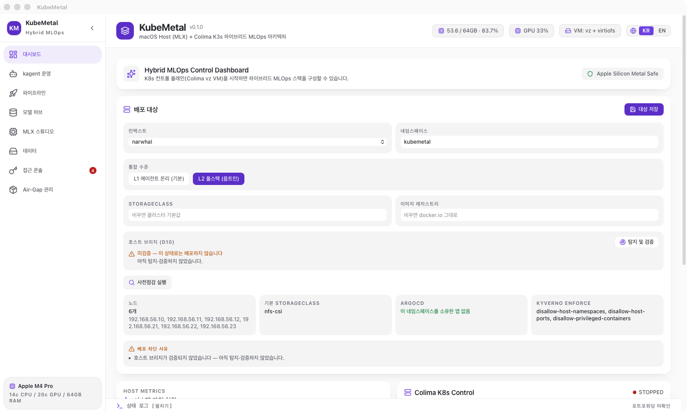

# KubeMetal

[English](README.md) | **한국어**



Apple Silicon 전용 하이브리드 MLOps 데스크톱 앱 — Kubernetes 표준 제어면과 macOS 호스트
네이티브 MLX 연산을 하나의 Tauri v2(Rust) + React/TypeScript 앱으로 통합합니다.

## 핵심 컨셉: Control/Compute 분리

KubeMetal은 **제어(Control)와 연산(Compute)을 물리적으로 분리**합니다. MLflow, SeaweedFS
같은 MLOps 스택은 Colima(`vz` + `virtiofs`) 위에서 구동되는 경량 K3s 클러스터 안에
파드로 배포되어 표준 K8s 매니페스트로 관리됩니다. 반면 MLX 기반 파인튜닝·서빙 같은 실제
연산은 K8s 파드 내부가 아니라 **macOS 호스트 프로세스**로 직접 실행됩니다.

이렇게 나누는 이유는 선호가 아니라 하드웨어 제약입니다. Apple Silicon의 Metal GPU는 리눅스
VM으로 패스스루할 수 없기 때문에, K8s Pod 안에서는 MLX 연산을 수행할 방법이 없습니다.
따라서 K8s는 실험 추적(MLflow)·아티팩트 저장(SeaweedFS) 같은 표준 MLOps 제어면 역할만
맡고, GPU를 쓰는 모든 작업은 Rust 백엔드가 스폰하는 호스트 프로세스로 위임됩니다.

이 하이브리드 구조 덕분에 클라우드 GPU 비용 없이 로컬 데스크톱에서 시작해, 향후 원격
GPU 서버나 멀티노드 K3s 클러스터로 자연스럽게 확장할 수 있는 경로를 열어둡니다.

## 요구 사항

- macOS 14+ (Apple Silicon)
- Homebrew
- colima, kubectl — `brew install colima kubectl`
- Node 22+ / pnpm
- Rust (rustup)

## 앱 구성 — 8개 탭

| 탭 | 역할 |
|----|------|
| **대시보드** | RAM/CPU 실시간 모니터링, Colima(vz) K8s 클러스터 원클릭 시작/정지, MLOps 스택 프로비저닝, 포트포워딩 제어 |
| **kagent 운영** | 클러스터 AIOps — 컨텍스트별 kagent 진단 조회, AI 에이전트(security / promql / observability) 켜고 끄기, kagent UI(8090) 연결. 외부 클러스터의 기본 통합 경로(D30 L1) |
| **파이프라인** | 클러스터 구동 → 프로비저닝 → 모델 다운로드 → 파인튜닝 → MLflow 등록 → 서빙까지 단계별 상태를 카드로 시각화 |
| **모델 허브** | Hugging Face 모델 검색 → 호스트 다운로드 → SeaweedFS S3 업로드 → MLflow Model Registry 등록까지 원클릭 흐름, 등록 모델 목록 조회 |
| **MLX 스튜디오** | 호스트 MLX venv 환경 설치, 로컬 모델 기반 LoRA 파인튜닝 실행(진행률/손실 실시간 표시), `mlx_lm.server` 모델 서빙 시작/정지 |
| **데이터** | 데이터 수집 DAG 파이프라인(웹/파일/HF → 청킹 → LanceDB RAG → SeaweedFS S3 백업), DVC 데이터셋 버전 관리 |
| **접근 콘솔** | MLflow / SeaweedFS Filer 등 프로비저닝된 서비스로 크리덴셜 없이 원클릭 접근, 헬스 상태 조회 |
| **Air-Gap 관리** | 폐쇄망용 오프라인 번들(이미지·차트·바이너리) 다운로드와 오프라인 설치, 자산 버전 확인 |

## 구동 방법

1. 의존성 설치
   ```bash
   pnpm install
   ```
2. 개발 모드 실행 — `beforeDevCommand`로 vite 개발 서버가 자동 기동됩니다.
   ```bash
   pnpm tauri dev
   ```
3. **대시보드** 탭의 **클러스터 시작** 버튼을 누르면 감지된 호스트 RAM 기반으로 자동
   산정된 CPU/메모리 값으로 다음 명령이 내부적으로 실행됩니다.
   ```bash
   colima start --cpu <N> --memory <M> --vm-type=vz --mount-type=virtiofs --kubernetes
   ```
4. **MLOps 스택 프로비저닝** 버튼을 눌러 MLflow / SeaweedFS(+크리덴셜 Secret) /
   mac-gpu-bridge 매니페스트를 클러스터에 적용합니다.
5. **포트포워딩 시작** 버튼을 눌러 아래 주소로 접속합니다.
   - MLflow: http://localhost:5001
   - SeaweedFS S3 API: http://localhost:8333
   - SeaweedFS Filer UI: http://localhost:8888
6. **모델 허브** 탭에서 모델을 다운로드하고, **MLX 스튜디오** 탭에서 파인튜닝/서빙을
   실행합니다. 전체 흐름은 **파이프라인** 탭에서, 서비스 접근은 **접근 콘솔** 탭에서
   각각 확인할 수 있습니다.

## 외부 클러스터 연결하기 (D30 — 기본: 에이전트 온리)

이미 있는 클러스터의 기본 통합은 **에이전트만 설치**하는 것입니다. MLOps 스택은 자체
k3s(colima)에 두고, 외부 클러스터는 관찰·진단·운영 대상으로만 연결합니다(브리지 없음).

```bash
make kagent-up CONTEXT=<kubeconfig-컨텍스트>   # kagent 0.9.12 helm 설치 (kagent ns)
```

이후 앱의 **kagent 운영 탭**에서 컨텍스트별 진단 조회와 에이전트(security/promql/
observability) 켜고 끄기를 수행합니다. kagent UI는 `make forward`로 8090에 열립니다.
이 경로는 실제 운영 중인 6노드 K3s HA 클러스터(narwhal)에서 검증됐습니다 — 서명된
패키징 앱에서 사전점검·kagent 진단 조회까지 in-app 실측(2026-07-30).
패키징 앱의 LAN 클러스터 접근에는 안정된 코드 서명이 필요합니다 — 키체인에 유효한
codesigning 아이덴티티가 있으면 `make app`이 자동 서명합니다(아래 D26 절 참고).

## 기존 클러스터에 배포하기 (D26 — 옵트인)

> 외부 클러스터의 **기본 통합은 에이전트 온리**입니다(D30) — 스택은 자체 k3s에 두고
> 외부 클러스터에는 kagent 에이전트만 설치하는 것이 기본 경로입니다. 아래 풀스택
> 배포는 전제조건(터미널 경로, 미러 레지스트리, ArgoCD 경계)을 확인한 뒤 명시적으로
> 선택하는 고급 경로입니다.

Colima를 새로 띄우지 않고 **이미 있는 Kubernetes 클러스터**에 MLOps 스택을 올릴 수
있습니다. 배포 대상은 kubeconfig 컨텍스트로 지정하며, 외부 클러스터는 `default`가 아닌
전용 `kubemetal` 네임스페이스를 씁니다.

1. 사전점검 — 도달성, 기본 StorageClass, 대상 ns를 소유한 ArgoCD Application,
   Kyverno Enforce 정책, 호스트 브리지 후보를 실측으로 확인합니다.
   ```bash
   make preflight CONTEXT=<컨텍스트> NAMESPACE=kubemetal
   ```
2. 렌더링 확인 — 적용하지 않고 결과만 봅니다.
   ```bash
   make render CONTEXT=<컨텍스트> BRIDGE_HOST=<호스트IP> STORAGE_CLASS=<SC>
   ```
   `BRIDGE_HOST`는 **1단계에서 확인한 후보 중 실제로 도달이 검증된 주소**여야 합니다.
   생략하면 렌더가 거부됩니다 — 지정하지 않으면 colima 전용 주소가 그대로 실려 나가
   파드가 조용히 죽기 때문입니다.
3. 적용
   ```bash
   make provision CONTEXT=<컨텍스트> BRIDGE_HOST=<호스트IP> STORAGE_CLASS=<SC>
   ```

이 풀스택 경로는 같은 6노드 클러스터에서 Kyverno Enforce 정책·사설 미러 레지스트리
(Docker Hub pull 제한 우회)·ArgoCD GitOps(selfHeal 경계, D27) 환경을 통과해 실측
검증됐습니다(2026-07-26, 터미널 경로). 이 편입 비용이 클러스터 수에 비례해 반복된다는
실측이 D30(기본 에이전트 온리)의 근거입니다.

> ℹ️ **서명된 빌드가 필요합니다.** ad-hoc 서명(빌드마다 식별자가 바뀜)에서는 macOS
> 로컬 네트워크 권한이 고정되지 않아 LAN kubectl이 `no route to host`로 막힙니다.
> 키체인에 유효한 codesigning 아이덴티티가 있으면 `make app`이 자동으로 그것으로
> 서명합니다(자가서명 인증서로 충분 — 이 Mac 한정, 실측 2026-07-29). 타인 배포용은
> Developer ID: `make app SIGNING_IDENTITY="Developer ID Application: …"`.
> 자세한 내용은 `docs/mistakes-log.md` 2026-07-27 항목.

**사내 레지스트리/미러가 필요한 경우** `IMAGE_REGISTRY=<호스트[/프로젝트]>`를 붙이면
Docker Hub 이미지가 그쪽으로 재지정됩니다(폐쇄망이거나 Docker Hub 익명 pull 제한에
걸리는 클러스터).

**ArgoCD가 대상 네임스페이스를 소유한 경우** 직접 apply는 selfHeal이 되돌립니다.
이때는 GitOps 경로를 씁니다(D27) — kubemetal은 파일만 내려놓고 Gitea push는 하지 않습니다.
```bash
make export-gitops NARWHAL_DIR=/path/to/narwhal CONTEXT=<컨텍스트> BRIDGE_HOST=<호스트IP>
```

### 트러블슈팅 (CLI로 직접 확인)

```bash
colima status --json
kubectl --context colima get pods -n default
# 외부 클러스터
kubectl --context <컨텍스트> get pods -n kubemetal
```

## 빌드 / 패키징

```bash
pnpm tauri build   # .app / .dmg 번들 생성 (서명 없음 로컬 빌드)
```

산출물: `src-tauri/target/release/bundle/macos/KubeMetal.app`,
`src-tauri/target/release/bundle/dmg/KubeMetal_0.1.0_aarch64.dmg`

> 비-GUI(헤드리스) 셸 세션에서는 `.dmg` 생성 단계가 Finder 아이콘 배치용 AppleScript에서
> 멈출 수 있다(Automation 권한 프롬프트를 응답할 GUI 세션이 없기 때문). 이 경우
> `src-tauri/target/release/bundle/dmg/bundle_dmg.sh`를 `--sandbox-safe` 옵션과 함께
> 직접 실행하면 Finder 꾸미기 단계를 건너뛰고 동일한 `.dmg`를 생성할 수 있다.

## 라이선스 및 서드파티 고지

KubeMetal은 Apache-2.0 라이선스다 — [LICENSE](LICENSE) 참고. 서드파티 고지는
세 파일로 나뉜다.

| 파일 | 다루는 범위 | 생성 시점 |
|------|--------|------|
| [NOTICE](NOTICE) | 런타임에 오케스트레이션되는 컴포넌트(Colima, K3s, kagent, MLflow, SeaweedFS, Prefect, MLX) — 실행 시 스폰/배포되며 바이너리에 포함되지 않음 | 정적, 커밋됨 |
| `THIRD-PARTY-NOTICES.md` | 앱에 컴파일/번들되는 Rust crate + npm 패키지 | 릴리스 시점, `Cargo.lock`/`pnpm-lock.yaml`에서 생성(`scripts/release/gen_third_party_notices.sh`) |
| `sbom-cyclonedx.json` / `sbom-spdx.json` | 같은 번들 의존성 그래프의 기계 판독용 인벤토리 | 릴리스 시점, Trivy로 생성(`scripts/release/gen_sbom.sh`) |

생성 파일들은 GitHub Release 자산으로 앱 zip과 함께 배포된다 — 커밋해두면
lockfile과 어긋나므로 커밋하지 않는다.

## 프로젝트 구조

```text
kubemetal/
├── src/               # Frontend (React + TypeScript + Tailwind)
├── src-tauri/         # Backend (Rust Native Control Agent)
├── scripts/k8s/       # MLflow / SeaweedFS(+크리덴셜 Secret) / mac-gpu-bridge 매니페스트
├── scripts/mlx/       # 호스트 MLX 파인튜닝 래퍼(finetune_wrapper.py)
└── docs/              # 기획서 · 요구사항 · MVP 설계 · 아키텍처 문서
```

## 문서 안내

| 문서 | 내용 |
|------|------|
| [docs/01-proposal.md](docs/01-proposal.md) | 프로젝트 기획서 — 문제 정의, 아키텍처, 기술 스택, 로드맵 |
| [docs/02-requirements.md](docs/02-requirements.md) | OSS 리서치 + FR/NFR 명세, IPC 커맨드 표, 매니페스트 스펙 |
| [docs/03-mvp-design.md](docs/03-mvp-design.md) | Phase 1 MVP 설계 — 디렉터리 구조, Rust/TS 참조 코드, 설계 결정 레지스트리(D1~D12) |
| [docs/04-architecture.md](docs/04-architecture.md) | 전체 아키텍처 — 계층 다이어그램, IPC 흐름, 포트 맵, K8s↔호스트 브릿지 |

## 실측 성능 (참고)

Apple M4 Pro / 64GB, 패키징 앱 경유, 2026-07-27~28 측정값입니다. 모델·프롬프트·하드웨어에
따라 달라집니다.

| 항목 | 실측값 | 조건 |
|------|--------|------|
| VLM 서빙 처리량 | 196–198 tok/s (서버 보고값) | Qwen2-VL-2B-Instruct-4bit, mlx-vlm 0.6.7, 이미지 포함 OCR 요청 |
| VLM 서빙 TTFT | 442–767 ms | 위와 동일 |
| LoRA 파인튜닝 (비전 스택 포함) | 학습 파라미터 674.5M (30.5%), 피크 메모리 8.7GB | Qwen2-VL-2B bf16, `--train-vision` |
| K8s VM 오버헤드 | 호스트 RAM 기반 자동 산정 (64GB 호스트 → VM 12GB/6CPU) | D4 프로파일 — 연산은 VM 밖 호스트에서 실행 |

## 개발 로드맵

- **Phase 1 (완료)**: Tauri v2 백엔드 + Colima(vz) 원클릭 라이프사이클 제어, sysinfo 기반
  RAM/CPU 모니터링, K8s 내 MLflow/SeaweedFS 1클릭 셋업
- **Phase 2 (구현 완료)**: 서비스 연동 자동 구성(MLflow↔SeaweedFS S3 와이어링), 모델
  허브(HF 검색→다운로드→업로드→등록), 호스트 MLX LoRA 파인튜닝 + 파이프라인 가시화,
  통합 접근 콘솔
- **Phase 3 (진행 중)**: 통합 대시보드 UI·`.dmg` 패키징·메모리 압박/배터리/슬립 방지
  가드레일은 완료. 발열 가드레일(고온 시 배치 크기 축소)과 (선택) powermetrics 기반
  Metal GPU 모니터링은 미착수

자세한 로드맵은 [docs/01-proposal.md §7](docs/01-proposal.md#7-단계별-개발-로드맵-roadmap) 참고.
