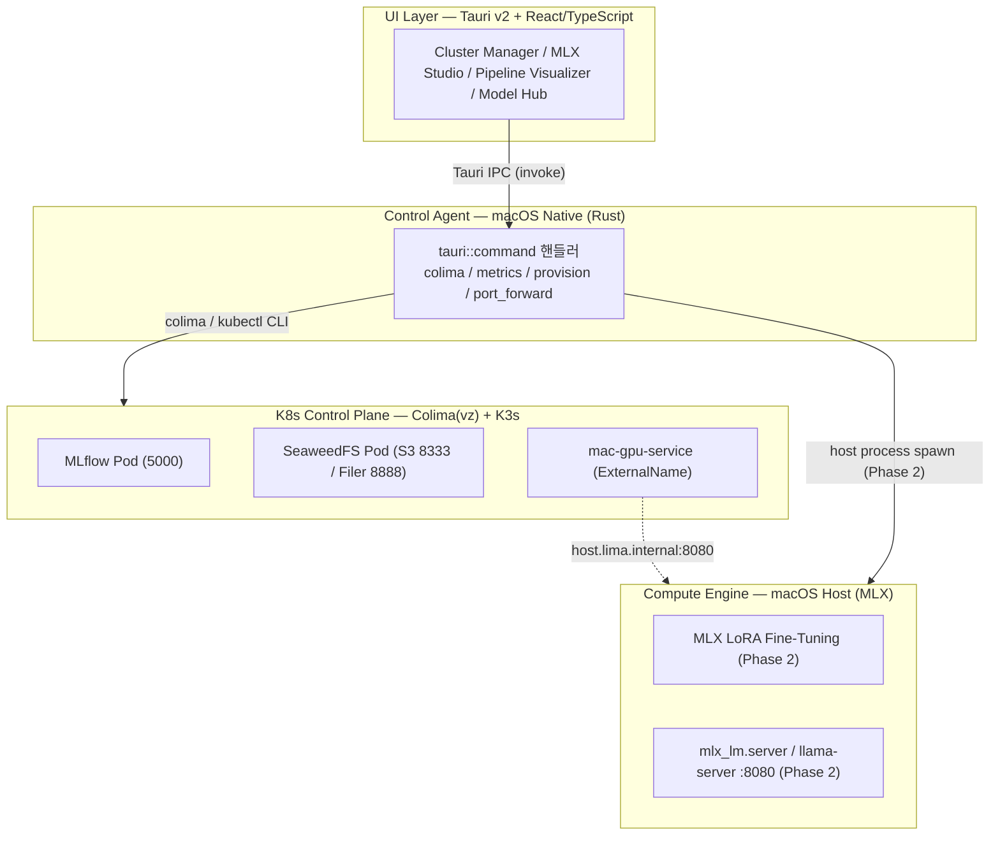
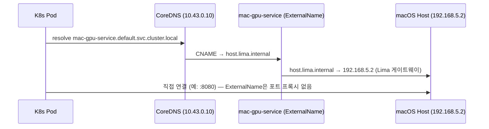

# 04. 전체 아키텍처

KubeMetal의 4계층 아키텍처, IPC 커맨드 흐름, 포트 맵, K8s↔호스트 브릿지를 정리합니다.
설계 결정(D1~D12)의 canonical 출처는 [docs/03-mvp-design.md §4](03-mvp-design.md#4-설계-결정-및-주의사항)이며,
본 문서는 그 결정을 인용만 하고 재서술하지 않습니다.

## 1. 전체 아키텍처 (4계층)

- **UI Layer**: React/TS 프론트엔드. `useColima`, `useMetrics` 훅으로 백엔드 IPC 커맨드를 호출.
- **Control Agent**: Rust `tauri::command` 계층. Colima/K3s 라이프사이클, 시스템 메트릭,
  매니페스트 프로비저닝, 포트포워딩을 담당.
- **K8s Control Plane**: Colima(`vz` + `virtiofs`) 위 K3s. MLflow/SeaweedFS 파드와
  `mac-gpu-service` ExternalName만 존재 — 연산 워크로드는 여기서 실행되지 않음.
- **Compute Engine**: macOS 호스트에서 직접 실행되는 MLX 프로세스(Phase 2 예약 범위).

## 2. IPC 커맨드 흐름

| 커맨드 | 설명 |
|--------|------|
| `get_system_metrics` | sysinfo 기반 RAM/CPU 사용률 조회 (Phase 1 메트릭 범위, D2) |
| `get_cluster_status` | `colima status --json` 파싱 + MLflow/SeaweedFS 파드 준비 상태 조회 |
| `start_cluster` | 감지된 호스트 RAM 기준 clamp된 cpu/memory로 `colima start` 실행 |
| `stop_cluster` | `colima stop` 실행 (포트포워딩 정리 선행) |
| `provision_mlops_stack` | `scripts/k8s/`의 MLflow/SeaweedFS/mac-gpu-bridge 매니페스트를 `kubectl apply` |
| `start_port_forward` | MLflow/SeaweedFS S3/Filer 3개 포트포워딩 프로세스 spawn |
| `stop_port_forward` | 실행 중인 포트포워딩 자식 프로세스 종료 |

### 프론트 훅 매핑

| 훅 | 갱신 주기 | 호출 커맨드 |
|----|-----------|-------------|
| `useMetrics` | 1000ms | `get_system_metrics` |
| `useColima` | 5000ms | `get_cluster_status` (+ `start_cluster` 트리거) |

## 3. 포트 맵 (D1)

| 서비스 | 호스트 포트 | 대상 |
|--------|-------------|------|
| MLflow | 5001 | `svc/mlflow` 5000 (5000은 macOS AirPlay Receiver 점유) |
| SeaweedFS S3 API | 8333 | `svc/seaweedfs` 8333 |
| SeaweedFS Filer UI | 8888 | `svc/seaweedfs` 8888 |
| 모델 서빙 (Phase 2) | 8080 | 호스트 `mlx_lm.server` / `llama-server` (설정 가능) |

## 4. K8s ↔ 호스트 브릿지

`mac-gpu-service`는 `default` 네임스페이스의 `ExternalName` Service로, `host.lima.internal`을
가리키는 DNS CNAME 별칭일 뿐 포트 프록시를 수행하지 않는다 — 클라이언트가 대상 포트를
직접 지정해 연결해야 한다.

## 5. 실측 검증된 사실 (2026-07-20, colima 0.10.3)

- `colima status --json`은 기동 중일 때만 exit 0 + 평면 JSON(`{"kubernetes": bool, ...}`)을
  출력한다. `status` 필드는 존재하지 않으며, 미기동 시 exit 1 + stdout 없음.
- `mac-gpu-service` → `host.lima.internal` → `192.168.5.2` CNAME 체인이 파드 내부
  busybox nslookup으로 정상 해석됨을 확인했다.
- MLflow(5001), SeaweedFS S3(8333)·Filer UI(8888) 포트포워딩 후 각각 HTTP 200 /
  `ListAllMyBucketsResult` 응답을 curl로 확인했다.

세부 내용은 [docs/03-mvp-design.md §5](03-mvp-design.md#5-미검증-전제-실기기-검증-필요) 참고.

## 6. Phase 2/3 확장 지점

- `run_mlx_finetune`, `kill_mlx_process` — 커맨드명·시그니처만 예약된 IPC 커맨드
  (docs/03-mvp-design.md D3). 상세 구현은 Phase 2 범위.
- 메모리 압박 가드레일(D11) — `warn`/`critical` memory pressure 레벨 기반 트리거,
  Phase 3에서 배터리/발열 가드레일과 함께 구현.
- Metal GPU 사용률 모니터링 — `powermetrics` 기반, root 권한 필요한 privileged helper
  방식으로 Phase 3 선택 기능(D2).

## 설계 결정 레지스트리

D1~D12 전체 목록과 근거는 [docs/03-mvp-design.md §4](03-mvp-design.md#4-설계-결정-및-주의사항)를
canonical 출처로 참고할 것 — 본 문서에서 중복 서술하지 않는다.
