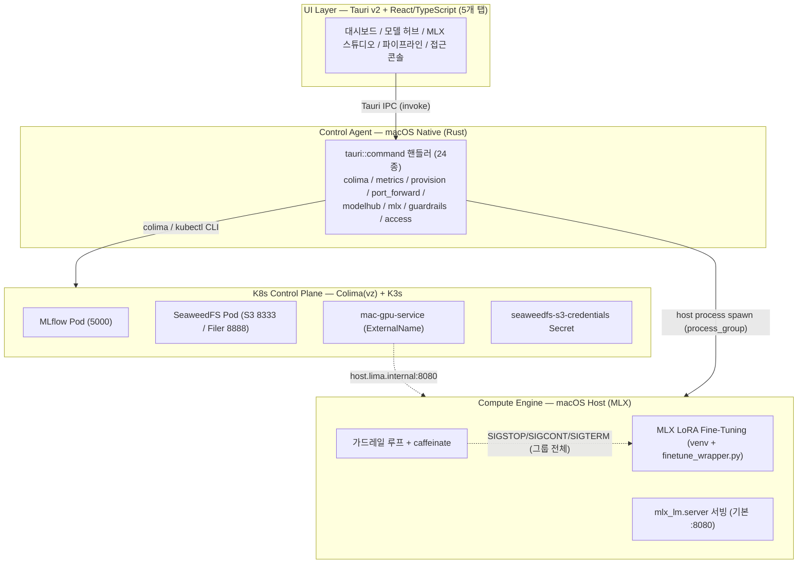
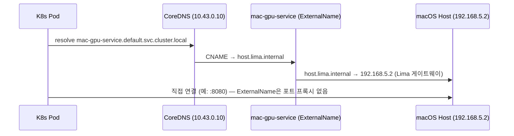

# 04. 전체 아키텍처

KubeMetal의 4계층 아키텍처, IPC 커맨드 흐름, 포트 맵, K8s↔호스트 브릿지를 정리합니다.
설계 결정(D1~D12)의 canonical 출처는 [docs/03-mvp-design.md §4](03-mvp-design.md#4-설계-결정-및-주의사항)이며,
본 문서는 그 결정을 인용만 하고 재서술하지 않습니다.

## 1. 전체 아키텍처 (4계층)

- **UI Layer**: React/TS 프론트엔드, 5개 탭(대시보드/모델 허브/MLX 스튜디오/파이프라인/
  접근 콘솔)으로 구성. `useColima`, `useMetrics` 등 훅으로 백엔드 IPC 커맨드를 호출.
- **Control Agent**: Rust `tauri::command` 계층. Colima/K3s 라이프사이클, 시스템 메트릭,
  매니페스트 프로비저닝, 포트포워딩, 모델 허브, MLX 파인튜닝/서빙, 하드웨어 가드레일,
  서비스 접근 콘솔을 담당(24개 커맨드, §2 참고).
- **K8s Control Plane**: Colima(`vz` + `virtiofs`) 위 K3s. MLflow/SeaweedFS 파드,
  SeaweedFS S3 크리덴셜 Secret, `mac-gpu-service` ExternalName이 존재 — 연산 워크로드는
  여기서 실행되지 않음.
- **Compute Engine**: macOS 호스트에서 직접 실행되는 MLX 프로세스. 파인튜닝 래퍼는
  `process_group(0)`으로 기동되어 가드레일 루프가 SIGSTOP/SIGCONT를 그룹 전체로 보내도
  자식 학습 프로세스까지 함께 멈춘다(D17).

## 2. IPC 커맨드 흐름

전체 24개 커맨드의 시그니처/설명은 [docs/02-requirements.md §4.1](02-requirements.md#41-tauri-rust-commands-frontend--backend-ipc)이 canonical 출처다. 아래는 기능군별 요약.

| 기능군 | 커맨드 | 설명 |
|--------|--------|------|
| 클러스터 제어 | `get_system_metrics` | sysinfo 기반 RAM/CPU 사용률 조회 (D2) |
| | `get_cluster_status` | `colima status --json` 파싱 + MLflow/SeaweedFS 파드 준비 상태 조회 |
| | `start_cluster` | 감지된 호스트 RAM 기준 clamp된 cpu/memory로 `colima start` 실행 |
| | `stop_cluster` | `colima stop` 실행 (포트포워딩 정리 선행) |
| | `provision_mlops_stack` | `scripts/k8s/`의 Secret + MLflow + SeaweedFS + mac-gpu-bridge 매니페스트 4종을 `kubectl apply` (D18: `resolve_bundled_resource`로 번들 `_up_/` 평탄화 경로 해석) |
| | `start_port_forward` / `stop_port_forward` | MLflow/SeaweedFS S3/Filer 3개 포트포워딩 자식 프로세스 spawn/종료 |
| 모델 허브 (Phase 2b) | `search_hf_models`, `download_hf_model`, `get_model_downloads`, `list_local_models` | Hugging Face 검색·다운로드(`~/.kubemetal/models/`)·진행 상태·로컬 목록 조회 |
| | `upload_model_to_storage`, `register_model_mlflow` | SeaweedFS S3(`models` 버킷) 업로드 → MLflow Model Registry 등록 |
| MLX 스튜디오 (Phase 2c) | `check_mlx_env`, `setup_mlx_env` | `~/.kubemetal/venv`의 python3/mlx-lm 상태 조회·설치 |
| | `run_mlx_finetune` | venv python으로 `scripts/mlx/finetune_wrapper.py`(D18 경로 해석) 실행, `process_group(0)`으로 기동(D17) |
| | `get_mlx_status`, `kill_mlx_process` | 환경/학습/서빙 통합 상태 조회, SIGTERM→SIGKILL 종료(학습은 그룹 전체 대상, D17) |
| | `start_model_serving`, `stop_model_serving` | `mlx_lm server` 기동/정지 |
| | `list_registered_models` | MLflow Model Registry 조회 → 파이프라인 뷰 "등록" 단계 노출 (FR-08) |
| 접근 콘솔 (Phase 2d) | `get_service_access` | MLflow/SeaweedFS S3·Filer/Model Serving 4종 헬스 + S3 크리덴셜 Secret 조회 (FR-09) |
| 하드웨어 가드레일 (Phase 3) | `get_guardrail_status`, `set_guardrail_config` | memory pressure(D16)·배터리 상태 조회, 배터리 시 자동 일시정지 설정 |
| | `pause_mlx_training`, `resume_mlx_training` | 학습 프로세스 그룹에 SIGSTOP/SIGCONT (D17) |

### 프론트 훅 매핑

| 훅 | 갱신 주기 | 호출 커맨드 |
|----|-----------|-------------|
| `useMetrics` | 1000ms | `get_system_metrics` |
| `useColima` | 5000ms | `get_cluster_status` (+ `start_cluster` 트리거) |

발열(고온 시 배치 축소) 가드레일과 powermetrics 기반 Metal GPU 모니터링은 아직 커맨드로
노출되지 않는다 — docs/01-proposal.md §7 로드맵의 Phase 3 미착수 항목.

## 3. 포트 맵 (D1)

| 서비스 | 호스트 포트 | 대상 |
|--------|-------------|------|
| MLflow | 5001 | `svc/mlflow` 5000 (5000은 macOS AirPlay Receiver 점유) |
| SeaweedFS S3 API | 8333 | `svc/seaweedfs` 8333 |
| SeaweedFS Filer UI | 8888 | `svc/seaweedfs` 8888 |
| 모델 서빙 (Phase 2) | 8080 | 호스트 `mlx_lm.server` / `llama-server` (설정 가능) |

## 4. K8s ↔ 호스트 브릿지

`mac-gpu-service`는 `default` 네임스페이스의 `ExternalName` Service로, `host.lima.internal`을
가리키는 DNS CNAME 별칭일 뿐 포트 프록시를 수행하지 않는다 — 클라이언트가 대상 포트를
직접 지정해 연결해야 한다.

## 5. 실측 검증된 사실 (colima 0.10.3, tauri 2.11.5)

- (2026-07-20) `colima status --json`은 기동 중일 때만 exit 0 + 평면 JSON
  (`{"kubernetes": bool, ...}`)을 출력한다. `status` 필드는 존재하지 않으며, 미기동 시
  exit 1 + stdout 없음.
- (2026-07-20) `mac-gpu-service` → `host.lima.internal` → `192.168.5.2` CNAME 체인이
  파드 내부 busybox nslookup으로 정상 해석됨을 확인했다.
- (2026-07-20) MLflow(5001), SeaweedFS S3(8333)·Filer UI(8888) 포트포워딩 후 각각 HTTP
  200 / `ListAllMyBucketsResult` 응답을 curl로 확인했다.
- (2026-07-21) `pnpm tauri build`로 생성한 `.app` 번들 실측: `resource_dir()`은 항상
  `Contents/Resources`를 가리키지만, `tauri.conf.json`의 `../scripts/...` 리소스는
  `Contents/Resources/_up_/scripts/...`로 평탄화되어 담긴다(D18). 번들 앱 기동 후 5초간
  프로세스 생존을 확인했다(패닉 없음).

세부 내용은 [docs/03-mvp-design.md §5](03-mvp-design.md#5-미검증-전제-실기기-검증-필요) 참고.

## 6. Phase 3 잔여 범위

- 발열 가드레일 — 고온 진입 시 MLX 배치 크기 자동 축소. `commands/guardrails.rs`는
  memory pressure(D16)·배터리 상태·caffeinate 연동까지만 구현되어 있고 온도 기반
  트리거는 아직 없다.
- Metal GPU 사용률 모니터링 — `powermetrics` 기반, root 권한 필요한 privileged helper
  방식으로 Phase 3 선택 기능(D2), 미착수.

`run_mlx_finetune`/`kill_mlx_process`(파인튜닝 실행·프로세스 그룹 종료, D17),
`pause_mlx_training`/`resume_mlx_training`(메모리 압박·배터리 가드레일 연동, D16)은
모두 구현 완료 상태이며 §2 표 참고.

## 설계 결정 레지스트리

D1~D18 전체 목록과 근거는 [docs/03-mvp-design.md §4](03-mvp-design.md#4-설계-결정-및-주의사항)를
canonical 출처로 참고할 것 — 본 문서에서 중복 서술하지 않는다.
