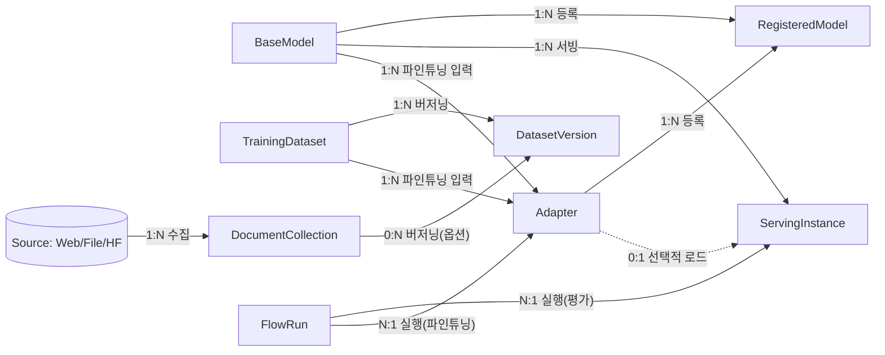

# 10. 용어 온톨로지(-라이트) — 엔티티·관계·정합 감사

> `docs/09-ontology-review.md` §4 권고에 따라 작성. 정의·판정은 모두 실물 코드
> (`src/types/ipc.ts`, `src/i18n/translations.ts`, `src/components/**`) 인용에 근거한다.
> D-레지스트리는 `docs/03-mvp-design.md` §4를 가리킨다.

## 1. 엔티티 8종

### BaseModel — 베이스 모델

- **정의**: 파인튜닝의 입력 또는 서빙의 기본 가중치로 쓰이는, 어댑터가 아직 얹히지 않은
  원본 모델. HuggingFace 검색 결과 단계에서는 아직 로컬에 존재하지 않는 "후보" 상태다.
- **한국어 표준 표기**: 검색/다운로드 맥락(HF 저장소 자체) = **"모델"**(섹션 헤더로
  "Hugging Face"를 병기해 맥락 구분) · 다운로드 후 로컬 디스크 = **"로컬 모델"** ·
  파인튜닝/서빙 입력 슬롯 = **"베이스 모델"**(고정 표기, 문맥 무관하게 통일).
- **저장 위치·수명주기**: HF 검색 결과(휘발성) → `download_hf_model`로
  `~/.kubemetal/models/{repo_id 슬러그}`에 다운로드(D14) → 파인튜닝/서빙 입력 또는
  `upload_model_to_storage`로 SeaweedFS `models` 버킷 업로드.
- **IPC 타입/필드**: `HfModel{id, downloads, likes, pipeline_tag?, size_bytes?}`
  (검색 결과) → `LocalModel{repo_id, path, size_bytes}`(다운로드 후) →
  `FineTuneConfig.model_path` / `MlxServingState.model_path`(사용 시).
- **관련 D**: D14(로컬 저장 경로), FR-07.1/07.2.

### Adapter — 어댑터

- **정의**: BaseModel + TrainingDataset로 LoRA/QLoRA 파인튜닝을 수행해 생성된 가중치
  델타. 단독으로는 서빙 불가 — 반드시 BaseModel과 함께 로드된다.
- **한국어 표준 표기**: **"어댑터"**(고정). "모델"로 지칭하지 않는다.
- **저장 위치·수명주기**: `run_mlx_finetune` 완료 시 `~/.kubemetal/adapters/{adapter_name}`
  생성(`adapter_config.json` 포함) → `start_model_serving`이 이 디렉터리를 감지해
  `adapter_config.json.model` 필드에서 베이스 모델 경로를 자동 승격(§4.1
  `start_model_serving` 설명).
- **IPC 타입/필드**: `FineTuneConfig.adapter_name` → `MlxTrainingState.adapter_path`
  → `MlxServingState.adapter_path`.
- **관련 D**: D17(프로세스 그룹 시그널 전파), D12(서빙 도구명 정정).

### RegisteredModel — 등록 모델

- **정의**: MLflow Model Registry에 등록되어 버전이 부여된 모델(어댑터 또는 베이스
  모델 어느 쪽이든 업로드 후 등록 가능, FR-07.4).
- **한국어 표준 표기**: **"등록 모델"**(목록/카운트 지칭) · 저장 위치 자체를 가리킬
  때는 **"MLflow 모델 레지스트리"**.
- **저장 위치·수명주기**: `upload_model_to_storage`(SeaweedFS) 이후
  `register_model_mlflow`가 MLflow Model Registry(호스트 포워딩 5001)에 등록.
- **IPC 타입/필드**: `RegisteredModel{name, latest_version?, last_updated_ms?}`
  (`list_registered_models`).
- **관련 D**: D13(아티팩트 스토어 SeaweedFS 연동), D14, FR-07.4/07.5.

### ServingInstance — 서빙 인스턴스

- **정의**: BaseModel(선택적으로 +Adapter)을 OpenAI 호환 REST API로 노출하는 호스트
  프로세스 1개(`mlx_lm.server` 또는 `llama-server`).
- **한국어 표준 표기**: 상태/동사구 = **"서빙"**("서빙 시작", "서빙 중") · 엔티티
  자체를 지칭할 명사가 필요하면 **"서빙 인스턴스"**(현재 UI에는 이 명사형 표기가
  없음 — §감사 결과 참고).
- **저장 위치·수명주기**: 휘발성 — `start_model_serving`으로 기동, PID/포트로
  추적, `stop_model_serving`/`kill_mlx_process`로 종료.
- **IPC 타입/필드**: `MlxServingState{pid, port, model_path, adapter_path?}`.
- **관련 D**: D12("mlx-serve"라는 도구는 존재하지 않음 — 정정), D3(IPC 커맨드명).

### TrainingDataset — 학습 데이터셋

- **정의**: MLX LoRA 파인튜닝의 입력으로 쓰이는 jsonl 형식 학습 샘플 디렉터리.
- **한국어 표준 표기**: **"학습 데이터셋"**(09 문서 §4 규칙과 일치, 권고) — 단,
  §감사 결과에 정리하듯 현재 UI 라벨은 "학습 데이터"로 "셋"이 누락되어 있다.
- **저장 위치·수명주기**: 사용자 지정 경로(기본값 `~/.kubemetal/datasets/smoke`,
  `MlxFineTuneCard`/`OrchestrationCard` 공통) — 홈 디렉터리 하위 실존 경로만 허용
  (D15 계열 검증).
- **IPC 타입/필드**: `FineTuneConfig.data_path`.
- **관련 D**: D15(venv 기반 MLX 학습).

### DatasetVersion — 데이터셋 버전

- **정의**: DVC로 커밋된 데이터 디렉터리의 스냅샷 1건(태그). TrainingDataset 또는
  RAG 수집 산출물(DocumentCollection) 어느 쪽이든 버저닝 대상이 될 수 있다.
- **한국어 표준 표기**: **"데이터셋 버전"**(태그 지칭 시 "데이터셋 버전 태그").
- **저장 위치·수명주기**: `dvc_commit_dataset`/`run_data_ingest`(auto_dvc_backup)이
  대상 디렉터리를 `dvc init --no-scm` + `add` + SeaweedFS S3 remote로 push, git
  태그로 기록(단, `--no-scm`이라 `tags`는 통상 빈 배열 — D-registry 주석 참고).
- **IPC 타입/필드**: `DvcVersionTag{tag, commit_hash, message, created_at?, dataset_path?}`,
  `DvcStatus.tags`.
- **관련 D**: D21(SSRF 가드·크리덴셜 env 주입).

### DocumentCollection — 문서 컬렉션

- **정의**: 웹/파일/HuggingFace 소스에서 수집·청킹·임베딩되어 LanceDB에 저장된
  벡터 인덱스 단위(RAG 검색 대상).
- **한국어 표준 표기**: **"문서 컬렉션"**(09 문서 §4 규칙, 엔티티 지칭) · UI 실사용은
  "컬렉션"(LanceDB 컬렉션 이름) 또는 "인덱싱 문서"(RAG 카드 통계) — TrainingDataset·
  DatasetVersion과 혼용 금지.
- **저장 위치·수명주기**: `index_documents`/`run_data_ingest`가 LanceDB
  `*.lance` 서브디렉터리로 생성, `get_rag_status`/`list_ingested_datasets`로 조회.
- **IPC 타입/필드**: `RagIndexStatus{document_count, total_chunks, ...}`,
  `IngestedDatasetInfo{collection_name, total_chunks, db_path, is_lance_table}`.
- **관련 D**: Phase 4c/5a FR(문서 §2 참고).

### FlowRun — 플로우 실행

- **정의**: Prefect가 트리거·추적하는 파인튜닝/평가 워크플로 실행 1건.
- **한국어 표준 표기**: **"플로우 실행"**(개별 run) · 이를 폴링·실행하는 호스트
  프로세스는 **"플로우 러너"**(이미 UI에 정착된 표기, `orch.runnerLabel`).
- **저장 위치·수명주기**: Prefect 서버(K3s 파드, SQLite, D19)에 상태 저장,
  `host_runner.py`가 `serve()`로 폴링·실행.
- **IPC 타입/필드**: `FlowRunInfo{id, name, state_type, state_name}`,
  `PrefectStatus.recent_runs`.
- **관련 D**: D19(Prefect 3, Process Worker 패턴), D17과 동일 원칙(프로세스 그룹).

## 2. 관계 다이어그램

- **파인튜닝**: `BaseModel` + `TrainingDataset` → `Adapter` (1개 BaseModel/TrainingDataset로
  여러 Adapter 생성 가능, N:1이 아니라 각 파인튜닝 실행마다 1개 Adapter 산출 — 즉 BaseModel
  1개가 여러 Adapter의 원천이 될 수 있어 1:N).
- **서빙**: `BaseModel`(+옵션 `Adapter`) → `ServingInstance`. 동시에 1개 서빙 인스턴스만
  허용(`start_model_serving`이 이미 서빙 중이면 Err) — 사실상 1:1 런타임 제약이 있지만,
  엔티티 관계 자체는 1개 BaseModel이 여러 서빙 인스턴스(순차적으로)의 기반이 될 수 있어 1:N.
- **등록**: `Adapter` 또는 `BaseModel` → `RegisteredModel`(둘 중 하나가 업로드·등록 대상,
  같은 `repo_id`가 여러 버전으로 등록될 수 있어 1:N).
- **버저닝**: `TrainingDataset` → `DatasetVersion`(태그 여러 개), `DocumentCollection`도
  선택적으로 DVC 백업 대상이 될 수 있음(0:N).
- **수집**: `Source`(Web/File/HuggingFace) → `DocumentCollection`(+선택적 `DatasetVersion`).
- **실행**: `FlowRun`이 파인튜닝(→Adapter 산출) 또는 평가(ServingInstance 대상 lm-eval)를
  대행 수행.

## 3. 금지·구분 규칙

1. **"모델" 단독 사용 금지 상황**: 파인튜닝/서빙 입력 슬롯(모델 선택 드롭다운)에서는
   반드시 **"베이스 모델"**로 고정 표기한다 — `MlxFineTuneCard`/`MlxServingCard`는 이미
   이렇게 하고 있으나 `OrchestrationCard`의 동일 슬롯은 "로컬 모델"로 표기해 어긋난다
   (§감사 결과 04번 항목). MLflow 등록 목록을 가리킬 때는 **"등록 모델"**, HF 검색
   결과를 가리킬 때는 섹션 헤더로 "Hugging Face" 맥락을 반드시 병기한다.
2. **"데이터셋" 수식 규칙**: 파인튜닝 입력 = **"학습 데이터셋"**, DVC 태그 = **"데이터셋
   버전"**, RAG·수집 산출물 = **"문서 컬렉션"**. "데이터셋"을 수식어 없이 단독으로 쓰지
   않는다 — 세 엔티티(TrainingDataset/DatasetVersion/DocumentCollection) 중 어느 것을
   가리키는지 항상 명시한다.
3. **"파이프라인" 구분**: (a) `tabs.pipeline`("파이프라인" 탭) = 인프라→모델 준비→학습→
   등록→서빙→평가의 **앱 내부 상태 뷰**(FR-08.2, Prefect 미도입), (b) Prefect가 관리하는
   것은 **"플로우"**(FlowRun) — "Prefect 파이프라인"이라 부르지 않는다, (c) 데이터
   수집 DAG는 **"데이터 수집 & DAG 파이프라인"**(`dataIngest.title`)으로 이미 구분
   표기되어 있음 — 이 3자를 "파이프라인"으로 뭉뚱그리지 않는다.

## 4. 감사 결과

전수 grep 대상: `ModelHub.tsx`/`ModelSearchCard.tsx`/`ModelHubGuideCard.tsx`/
`LocalModelsCard.tsx`/`modelCategories.ts`, `MlxServingCard.tsx`, `MlxFineTuneCard.tsx`,
`PipelineView.tsx`, `OrchestrationCard.tsx`, `DataView.tsx`/`DataIngestionDagCard.tsx`/
`RagCard.tsx`/`DvcCard.tsx`, `translations.ts`.

| 위치(파일:줄) | 현재 문구 | 실제 가리키는 엔티티 | 판정 | 권고 문구 |
|---|---|---|---|---|
| `src/components/mlx/MlxServingCard.tsx:114` | `t('mlx.adapterPathOptional')` — **`translations.ts`에 키 없음**, 화면에 `mlx.adapterPathOptional` 원문 그대로 노출 | Adapter (경로 입력 라벨) | **오용** | 기존 키 `mlx.adapterPathHintLabel`("LoRA 어댑터 경로 (선택)")을 재사용하거나 동일 값으로 신규 정의 |
| `src/components/mlx/MlxServingCard.tsx:126` | `t('mlx.portLabel')` — **키 없음**, `mlx.portLabel` 원문 노출 | ServingInstance (포트 필드) | **오용** | `mlx.servingPortLabel`("서빙 포트") 재사용 또는 별도 정의 |
| `src/components/modelhub/ModelSearchCard.tsx:66` | `t('modelhub.searchTitle')` — **키 없음**, `modelhub.searchTitle` 원문 노출 | BaseModel(HF 검색 섹션 제목) | **오용** | "HF 모델 검색" / "Hugging Face 모델 검색" 신규 키 정의 |
| `src/components/pipeline/OrchestrationCard.tsx:230` (`orch.localModelLabel`="로컬 모델") vs `src/components/mlx/MlxFineTuneCard.tsx:69`, `MlxServingCard.tsx:97` (`mlx.selectBaseModel`="베이스 모델 선택") | 동일 관계(파인튜닝 대상 모델 선택)를 "로컬 모델"과 "베이스 모델"로 다르게 표기 | BaseModel | **모호** | 규칙 1에 따라 "베이스 모델"로 통일 |
| `src/components/modelhub/ModelSearchCard.tsx:116,119`, `ModelHubGuideCard.tsx:26,29,31,64`, `src/lib/modelCategories.ts` 설명문 전반 | "모델을 불러오는 중...", "인기 모델", "권장 모델 규모" 등 — HF 검색 결과(아직 로컬 부재)를 "모델"로 통칭 | BaseModel 후보(HfModel) | **모호** | 섹션 헤더 "Hugging Face"로 일부 완화되나, 리스트 아이템 자체에도 "HF 모델" 명시 권고 |
| `src/components/modelhub/LocalModelsCard.tsx:35` (`modelhub.localModelsTitle`="로컬 다운로드 모델 목록") | "로컬 다운로드 모델 목록" | BaseModel(LocalModel, 다운로드 후) | **정합** | — |
| `src/components/mlx/MlxFineTuneCard.tsx:86` (`mlx.datasetPathLabel`="학습 데이터 디렉토리") | "학습 데이터 디렉토리" — 규칙 2의 "학습 데이터셋"에서 "셋" 누락 | TrainingDataset | **모호** | "학습 데이터셋 디렉토리"로 수정 |
| `src/components/pipeline/DataIngestionDagCard.tsx:28-30` (`sourceOptions` label), `dagNodeDefinitions`의 `titleKey`/`subtitle` 전체(예: "1. Source Ingestion", "Recursive Character Splitter", "HuggingFace Dataset") | 한국어 UI(`language==='ko'`)에서도 `t()`를 거치지 않아 영어 원문이 그대로 노출 | DocumentCollection 수집 단계 라벨 | **오용** | `translations.ts`에 `dataIngest.source*`/`dataIngest.node*` 키를 추가하고 `t()`로 이관 |
| `src/components/pipeline/DvcCard.tsx:86,139`(주석), `translations.ts` `dvc.title`/`dvc.createTagBtn`/`dvc.registeredTagsHeader` | "데이터셋 버전 태그" 계열로 일관 | DatasetVersion | **정합** | — |
| `src/components/pipeline/PipelineView.tsx:207-238` (`pipeline.registerReady`="등록 모델 {count}개", `pipeline.registerLatest`) | "등록 모델" | RegisteredModel | **정합** | — |
| `translations.ts` `dataIngest.collectionName`("LanceDB 컬렉션 이름"), `rag.indexedDocs`("인덱싱 문서:") | "컬렉션"/"인덱싱 문서" — TrainingDataset과 구분됨 | DocumentCollection | **정합** | — |
| `src/components/pipeline/OrchestrationCard.tsx` 헤더("Prefect" 아이브로우 + `orch.title`="오케스트레이션"), `pipeline.title`="파이프라인 가시화" 탭 안에 배치 | 탭명은 "파이프라인", 카드 아이브로우는 "Prefect" — 규칙 3의 (a)/(b) 구분이 시각적으로 인접해 있어 최상단에서 혼동 유발 가능 | FlowRun(플로우 러너) vs 파이프라인 탭(앱 내부 상태 뷰) | **모호** | `pipeline.subtitle`이 이미 "앱 내 오케스트레이션 상태"임을 명시하고 있어 완전 오용은 아니나, `OrchestrationCard` 제목을 "플로우 오케스트레이션(Prefect)"처럼 한 번 더 명시하면 혼동이 줄어듦 |

### 요약

- 총 12건 감사: **정합 4건**, **모호 4건**, **오용 4건**.
- **심각(사용자 혼란 유발) 상위 5건**:
  1. `MlxServingCard.tsx:114` — `mlx.adapterPathOptional` 키 누락으로 라벨에 원문 i18n 키가
     그대로 노출(한/영 공통).
  2. `MlxServingCard.tsx:126` — `mlx.portLabel` 키 누락, 동일 증상.
  3. `ModelSearchCard.tsx:66` — `modelhub.searchTitle` 키 누락, 모델 허브 검색 카드
     제목이 원문 키로 노출.
  4. `OrchestrationCard.tsx:230` vs `MlxFineTuneCard.tsx:69`/`MlxServingCard.tsx:97` —
     같은 "베이스 모델 선택" 관계를 "로컬 모델"/"베이스 모델"로 다르게 표기해, 두
     화면의 드롭다운이 같은 개념인지 사용자가 알아채기 어려움(`docs/09` §3이 지적한
     "모델" 혼용 사례의 실제 인스턴스).
  5. `DataIngestionDagCard.tsx` `sourceOptions`/`dagNodeDefinitions` — 한국어 UI에서도
     `t()` 미적용으로 영어 원문("HuggingFace Dataset", "Source Ingestion" 등)이 그대로
     노출되어 엔티티 표기 이전에 언어 자체가 깨짐.
