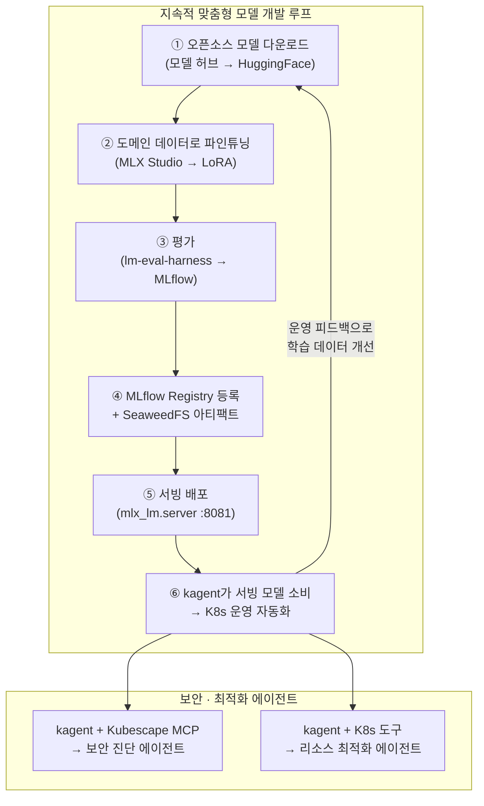

# kagent × KubeMetal: 모델 연계 K8s 최적화 · 보안 진단 · 지속적 맞춤형 모델 개발 종합 검토

> 2026-07-24 · 기반: [08-kagent-feasibility.md](08-kagent-feasibility.md) 실험 결과 + 리서치

## 결론: **충분히 가능하며, KubeMetal의 기존 아키텍처와 궁합이 매우 좋다**

kagent(K8s 에이전틱 운영) + KAITO/Kubeflow Training Operator(모델 학습) + Kubescape/Trivy(보안) 조합으로 KubeMetal 위에 **"오픈소스 모델 지속적 맞춤화 루프"**를 구현할 수 있다. 단, 각 도구의 역할을 정확히 분리해야 한다.

> **서빙 포트 표기**: D1의 기본 서빙 포트는 **8080**이며 `suggest_serving_port`가 8080~8099에서 비어 있는 첫 포트를 제안한다. 본 문서의 `:8081`은 08문서 실험에서 8080이 선점돼 있어 실제로 사용된 포트이며, 아키텍처 기본값이 아니다(kagent UI는 8090 — D1 참조).

---

## 1. 도구 역할 분리 — 혼동하지 말 것

| 도구 | 역할 | KubeMetal 적합성 |
|------|------|-----------------|
| **kagent** (CNCF Sandbox) | K8s 클러스터 **운영 자동화** — 트러블슈팅, 리소스 진단, Helm 관리, Prometheus 쿼리 등을 LLM 에이전트가 수행 | ✅ 이미 실험 성공 (08문서). D10 브릿지로 로컬 LLM 연결 검증 완료 |
| **KAITO** (CNCF Sandbox) | 오픈소스 LLM **파인튜닝·서빙 자동화** — CRD로 모델 선언하면 GPU 노드 프로비저닝 + LoRA/QLoRA 수행 | ⚠️ GPU 노드 프로비저너(Karpenter) 전제. Apple Silicon에선 **호스트 MLX가 이미 이 역할** |
| **Kubeflow Training Op** | 분산 학습 오케스트레이션 (PyTorchJob, JAXJob 등) | ⚠️ 클러스터 GPU 전제. 로컬 K3s에서는 **과도한 오버헤드** |
| **Kubescape** (ARMO) | K8s 보안 스캐닝 — NSA/MITRE 프레임워크 기반 구성 취약점, 이미지 CVE, RBAC 감사 | ✅ MCP 서버로 제공 → **kagent 에이전트의 도구로 바로 연결 가능** |
| **Trivy** (Aqua Security) | 컨테이너 이미지·파일시스템·IaC 취약점 스캐닝 | ✅ CLI 기반. kagent 커스텀 도구로 래핑 가능 |

> [!IMPORTANT]
> kagent는 **모델을 학습시키는 도구가 아니다**. 학습된 모델을 **소비**(추론)하여 K8s 운영을 자동화하는 프레임워크다. KubeMetal의 MLX 파인튜닝 파이프라인과 kagent는 **상호보완** 관계이지 경쟁이 아니다.

---

## 2. KubeMetal에서의 통합 아키텍처 제안



### 핵심: 이미 검증된 D10 브릿지가 모든 것을 연결한다

```
kagent 파드 (K3s) 
  → mac-gpu-service (ExternalName → host.lima.internal)
    → 호스트 mlx_lm.server (:8081/v1)
      → 파인튜닝된 맞춤형 모델 (Qwen2.5-7B-Instruct + LoRA 어댑터)
```

이 경로는 [08문서 실험](08-kagent-feasibility.md)에서 **이미 검증 완료**. 외부 API 비용 $0.

---

## 3. 세 가지 확장 시나리오 상세 검토

### 3A. 모델 연계 K8s 리소스 최적화

**현재 상태**: kagent의 `k8s-agent`가 파드 진단(ImagePullBackOff 등)을 수행하는 것까지 확인됨.

**확장 방향**:

| 기능 | 구현 방식 | 난이도 |
|------|----------|--------|
| 리소스 요청/제한 최적화 제안 | kagent K8s 에이전트 + `kubectl top pods` 도구 추가 | 🟢 낮음 |
| Prometheus 기반 자원 추세 분석 | Prometheus 스택 추가 배포 + kagent promql-agent 활성화 | 🟡 중간 (VM 메모리 +1~2GB) |
| 자동 HPA 권고 | 커스텀 MCP 도구: 현재 메트릭 → HPA manifest 생성 | 🟡 중간 |
| VPA 기반 right-sizing | VPA 설치 + kagent 연동 | 🟠 높음 (K3s에서 VPA 안정성 미지) |

> [!TIP]
> 1차로 가장 실용적인 것: **kagent에게 "현재 파드들의 리소스 사용률 대비 요청량을 분석하고 최적화 제안을 해줘"라고 요청** → 이미 내장된 K8s 도구로 `kubectl top` + `kubectl get pods -o yaml` 조합이면 충분하다.

### 3B. 보안 진단

**Kubescape를 MCP 서버로 kagent에 연결하는 것이 가장 효율적인 경로.**

| 단계 | 상세 |
|------|------|
| 설치 | `helm install kubescape` (ns kubescape, ~200MB) |
| MCP 연결 | Kubescape가 공식 MCP 서버 제공 → kagent `MCPServer` CRD로 등록 |
| 에이전트 정의 | `security-agent` CRD 생성: system prompt = "K8s 보안 전문가, NSA 프레임워크 기반 진단" |
| 시나리오 | "현재 클러스터의 보안 취약점을 스캔하고 심각도순으로 보고해줘" |

**보안 진단 범위**:
- 컨테이너 이미지 CVE 스캐닝 (Trivy 연동)
- RBAC 과다 권한 감사
- 네트워크 정책 부재 탐지
- Pod Security Standards 위반 (privileged, hostNetwork 등)
- Secret 노출 여부

> [!WARNING]
> kagent 자체의 보안도 고려 필요. 에이전트가 `kubectl apply/delete` 권한을 가지면 **confused deputy 공격** 가능. 최소 권한 RBAC(읽기 전용 ClusterRole)로 시작하고, 쓰기 작업은 human-in-the-loop 승인 필수.

### 3C. 지속적 맞춤형 모델 개발 (핵심 제안)

이것이 KubeMetal의 가장 차별화된 가치가 되는 시나리오다.

```
[오픈소스 모델] → [도메인 특화 파인튜닝] → [평가] → [서빙] → [운영 피드백] → [재학습]
      ↓                    ↓                ↓          ↓            ↓
  모델 허브(HF)      MLX LoRA         lm-eval       mlx_lm     kagent 에이전트가
  이미 구현 ✅       이미 구현 ✅     구현 완료 ✅   구현 ✅    실전 사용하며 피드백
```

**현재 KubeMetal이 이미 구현한 것** (Phase 1~4b):
1. ✅ HuggingFace 모델 검색·다운로드 (모델 허브)
2. ✅ MLX LoRA 파인튜닝 + 실시간 진행률 (MLX 스튜디오)
3. ✅ MLflow 실험 추적 + Model Registry 등록
4. ✅ SeaweedFS 아티팩트 저장
5. ✅ `mlx_lm.server` 서빙
6. ✅ lm-eval-harness 평가 자동화 (Phase 4b)
7. ✅ Prefect 파이프라인 오케스트레이션 (Phase 4a)

**kagent 연계로 추가되는 것**:
1. 🆕 **파인튜닝된 모델의 실전 소비자** — "K8s Ops 전문가" 에이전트
2. 🆕 **운영 피드백 루프** — 에이전트가 해결하지 못한 케이스를 학습 데이터로 피드백
3. 🆕 **A/B 모델 비교** — Registry의 여러 버전을 순차 서빙하며 에이전트 성능 비교
4. 🆕 **도메인 특화 데이터 수집** — kagent 대화 로그에서 K8s 운영 QA 쌍 추출

---

## 4. 구현 로드맵 제안 (Phase 5 후보)

| 단계 | 범위 | 예상 공수 | 메모리 영향 |
|------|------|----------|------------|
| **5a. kagent 정식 편입** | 불필요 에이전트 비활성화 values 고정, 프로비저닝 셋에 추가 (옵트인), 접근 콘솔 UI 링크 | 반나절 | +2~3GB (현 17→줄인 5~6개 에이전트) |
| **5b. 보안 에이전트** | Kubescape Helm 설치 + MCP 서버 CRD + security-agent CRD | 1일 | +200~300MB |
| **5c. 리소스 최적화 에이전트** | 커스텀 MCP 도구 (kubectl top 래핑) + resource-optimizer-agent CRD | 반나절 | 추가 없음 |
| **5d. 맞춤형 모델 파이프라인** | K8s Ops 도메인 데이터셋 구축 → LoRA 파인튜닝 → kagent 모델 교체 → 성능 비교 | 2~3일 | 모델 크기 의존 |
| **5e. 피드백 루프 자동화** | kagent 대화 로그 → QA 쌍 추출 스크립트 → 파인튜닝 데이터에 추가 → Prefect flow 트리거 | 2~3일 | 추가 없음 |

---

## 5. 리스크 및 제약

| 리스크 | 영향 | 완화 |
|--------|------|------|
| **VM 메모리 한계** | 현재 12GB VM에서 kagent(7.2GB) + Kubescape(+200MB) + Prometheus(+1GB) 추가 시 압박 | 64GB 호스트는 VM을 16~20GB로 확장 가능. 16GB 호스트는 Prometheus 배제 |
| **모델 품질 한계** | 7B-4bit가 복잡한 multi-step reasoning에서 실패할 수 있음 | LoRA 파인튜닝으로 K8s 도메인 정확도 향상. 14B+ 모델은 64GB 호스트 전용 |
| **보안 에이전트 권한 과다** | 진단용 에이전트가 `kubectl delete` 가능하면 위험 | 읽기 전용 RBAC + human-in-the-loop. kagent의 `HumanInTheLoop` CRD 활용 |
| **Apple Silicon 제약** | KAITO/Kubeflow Training Op는 Linux GPU 전제 → K3s 파드 내 학습 불가 | KubeMetal의 핵심 설계 결정(D10: Control/Compute 분리)이 이미 해결. 학습은 항상 호스트 MLX |
| **kagent 버전 불안정** | 2025-04 이후 활발한 개발, API 변동 | Helm 차트 버전 고정 (현재 0.9.12) |

---

## 6. 경쟁 우위 분석

KubeMetal + kagent 조합이 만드는 **독특한 포지션**:

```
기존 접근 방식:
  클라우드 GPU + Kubeflow + 외부 LLM API (OpenAI) + 별도 보안 도구
  → 비용 높음, 데이터 외부 유출 가능

KubeMetal 접근:
  Apple Silicon 로컬 + K3s + 자체 파인튜닝 모델 + kagent + Kubescape
  → 비용 $0, 데이터 완전 로컬, "나만의 K8s Ops AI" 구현
```

| 경쟁자 | KubeMetal 차별점 |
|--------|-----------------|
| LM Studio, Ollama | 추론/채팅만 가능. 파인튜닝·MLOps·K8s 연동 없음 |
| Transformer Lab | MLX 파인튜닝 있지만 K8s 제어면·에이전틱 운영·보안 진단 없음 |
| 클라우드 MLOps (Vertex AI 등) | GPU 비용 발생, 데이터 외부. KubeMetal은 완전 로컬 |
| kagent 단독 | 모델은 외부 API 의존. KubeMetal은 **모델도 직접 만듦** |

---

## 7. 요약

> kagent는 KubeMetal의 MLOps 파이프라인이 만든 **맞춤형 모델의 첫 실전 소비자**이자, 그 모델을 더 개선하기 위한 **피드백 루프의 시작점**이다.

세 가지 요청의 실현 가능성:

| 요청 | 가능 여부 | 근거 |
|------|----------|------|
| 모델 연계 K8s 리소스 최적화 | ✅ 가능 | kagent K8s 에이전트 + kubectl top 도구. 이미 실험 성공한 인프라 위에서 도구만 추가 |
| 보안 진단 | ✅ 가능 | Kubescape MCP → kagent security-agent. 설치 200MB 수준 |
| 오픈소스 모델 지속적 맞춤형 개발 | ✅ 가능 (가장 강력) | HF→MLX LoRA→eval→MLflow→서빙→kagent 소비→피드백. **파이프라인 대부분 이미 구현 완료** |
