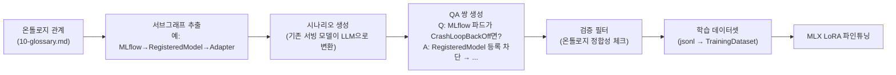
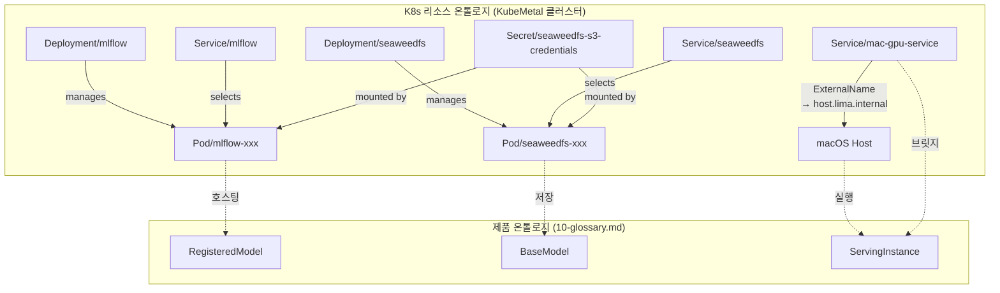
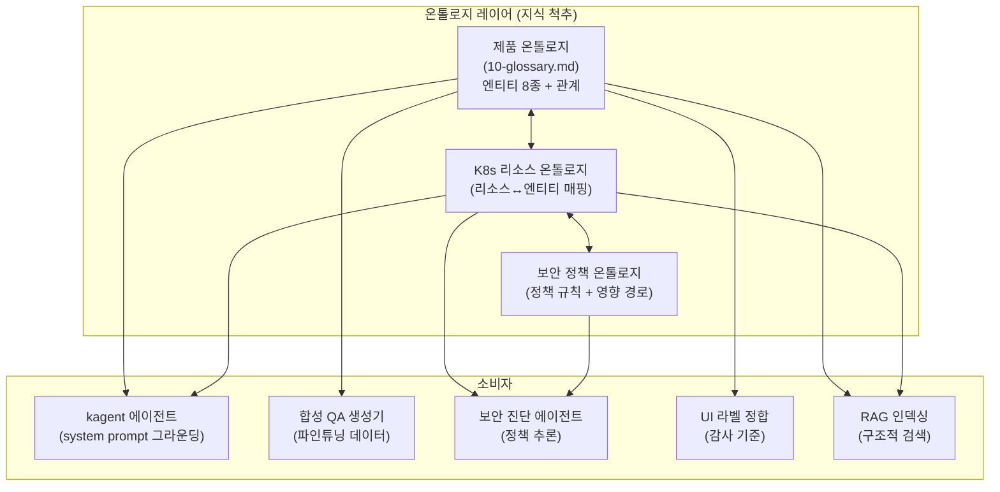

# 12. 온톨로지 추가 활용방안 검토 — 에이전트 그라운딩 · 학습 데이터 · K8s 리소스 그래프

> 2026-07-24 · 기반: [09-ontology-review.md](09-ontology-review.md)(블로그·Playground 검토),
> [10-glossary.md](10-glossary.md)(엔티티 8종·관계·감사), [11-kagent-mlops-integration.md](11-kagent-mlops-integration.md)(kagent×MLOps 통합 검토)

## 결론: **현재 용어 온톨로지(10문서)를 4가지 방향으로 확장하면 kagent·MLOps·보안 전체를 관통하는 "지식 척추"가 된다**

09문서에서 채택한 "경량 용어집(1단계)"은 UI 라벨 정합에는 충분하지만, kagent 에이전트 운영·
지속적 모델 개발·보안 진단이 본격화되면 온톨로지의 역할이 단순 용어 사전에서 **에이전트의
세계 모델·학습 데이터 생성기·정책 추론 기반**으로 확장된다.

> **서빙 포트 표기**: D1의 기본 서빙 포트는 **8080**이며 `suggest_serving_port`가 8080~8099에서 비어 있는 첫 포트를 제안한다. 본 문서의 `:8081`은 08문서 실험에서 8080이 선점돼 있어 실제로 사용된 포트이며, 아키텍처 기본값이 아니다(kagent UI는 8090 — D1 참조).

---

## 1. 현재 상태 요약 (이미 있는 것)

| 자산 | 내용 | 한계 |
|------|------|------|
| [10-glossary.md](10-glossary.md) 엔티티 8종 | BaseModel, Adapter, RegisteredModel, ServingInstance, TrainingDataset, DatasetVersion, DocumentCollection, FlowRun + mermaid 관계도 | 제품 내부 개념만. K8s 리소스·kagent 도구·보안 정책 개념이 없음 |
| D-레지스트리 (D1~D21) | 설계 결정 + 근거 + 탈출구 | 결정의 **why**는 있지만, 개념 간 관계의 **what**은 glossary에 위임 |
| mistakes-log | 실수 패턴 기록 | 비구조적 — 에이전트가 활용하기엔 자연어 서술만 존재 |
| RAG 인덱싱 (Phase 4c) | `docs/`를 LanceDB에 인덱싱 → 에이전트 컨텍스트 | 벡터 유사도만 — 엔티티 관계를 따라가는 구조적 검색 불가 |

---

## 2. 네 가지 확장 방향

### 2A. kagent 에이전트 그라운딩 — "세계 모델로서의 온톨로지"

**문제**: kagent의 K8s 에이전트가 "MLflow 파드가 죽었다"는 진단을 할 때, 이것이
KubeMetal 맥락에서 무엇을 의미하는지(모델 등록 불가 → 파이프라인 3단계 중단 →
파인튜닝 결과 유실 위험) 모른다. 도구 호출은 잘 하지만 **도메인 추론이 없다**.

**해결**: 온톨로지를 kagent 에이전트의 `system_prompt`에 구조화된 도메인 지식으로 주입.

```yaml
# kagent Agent CRD — 확장된 system prompt 예시
apiVersion: kagent.dev/v1alpha1
kind: Agent
metadata:
  name: kubemetal-ops-agent
spec:
  systemPrompt: |
    너는 KubeMetal 클러스터의 운영 전문가다.
    
    ## 도메인 온톨로지
    KubeMetal은 다음 엔티티로 구성된다:
    - BaseModel → (파인튜닝) → Adapter → (등록) → RegisteredModel
    - BaseModel + Adapter → (서빙) → ServingInstance(:8081)
    - TrainingDataset → (버저닝) → DatasetVersion (DVC + SeaweedFS)
    - FlowRun: Prefect가 관리하는 파인튜닝/평가 실행 단위
    
    ## K8s 리소스 ↔ 엔티티 매핑
    - Pod/mlflow → RegisteredModel의 저장소. 이 파드가 죽으면 모델 등록·조회 불가
    - Pod/seaweedfs → BaseModel·Adapter·DatasetVersion의 아티팩트 스토리지
    - Svc/mac-gpu-service → ServingInstance로의 브릿지 (host.lima.internal)
    - Pod/prefect-server → FlowRun 오케스트레이션. 죽으면 파이프라인 자동화 중단
    
    ## 영향도 추론 규칙
    - mlflow 파드 장애 → 심각도 HIGH (등록·평가 결과 조회 모두 차단)
    - seaweedfs 파드 장애 → 심각도 CRITICAL (아티팩트 유실 가능)
    - mac-gpu-service 해석 실패 → 심각도 MEDIUM (서빙만 영향, 학습은 호스트 직접)
```

| 수준 | 구현 방식 | 효과 | 난이도 |
|------|----------|------|--------|
| **L1: 프롬프트 주입** | glossary.md를 system prompt에 인라인 | 에이전트가 "MLflow 죽음 = 등록 불가" 추론 | 🟢 즉시 가능 |
| **L2: RAG 연계** | glossary + D-레지스트리를 LanceDB에 인덱싱, 에이전트가 검색 도구로 조회 | 컨텍스트 길이 절약 + 전체 문서 접근 | 🟡 Phase 4c 연계 |
| **L3: 구조적 GraphRAG** | 엔티티·관계를 LanceDB/Neo4j에 트리플로 저장, 다중 홉 질의 | "seaweedfs 장애가 어떤 FlowRun에 영향?" 같은 연쇄 추론 | 🟠 중장기 |

> [!TIP]
> **L1이 즉시 ROI가 가장 높다.** kagent Agent CRD의 `systemPrompt`에 10-glossary.md의 엔티티·관계 + K8s 리소스 매핑을 넣으면, 이미 동작하는 k8s-agent가 도메인 인식 진단을 시작한다. 추가 인프라 불필요.

### 2B. 파인튜닝 학습 데이터 자동 생성 — "온톨로지 → 합성 QA"

**문제**: 11문서(§3C)에서 "K8s Ops 도메인 데이터셋 구축"을 제안했지만, 고품질 QA 쌍을
수동으로 만드는 것은 비용이 크다.

**해결**: 온톨로지의 엔티티·관계를 **합성 학습 데이터 생성의 뼈대**로 사용 (KG-SFT 패턴).

```
온톨로지 관계 그래프에서 추론 서브그래프 추출
  → 각 서브그래프를 자연어 시나리오로 변환 (LLM으로 생성)
  → QA 쌍 + 추론 경로 설명을 학습 데이터로 사용
  → LoRA 파인튜닝 → 도메인 특화 모델
```

**구체적 생성 파이프라인**:



**생성 가능한 QA 카테고리** (온톨로지 기반):

| 카테고리 | 온톨로지 근거 | 예시 Q | 예시 A |
|----------|-------------|--------|--------|
| 장애 영향 분석 | Pod→엔티티 매핑 | "seaweedfs 파드가 OOM으로 죽었다. 영향은?" | "BaseModel·Adapter 아티팩트 접근 불가, DatasetVersion DVC push 실패, MLflow artifact store 단절" |
| 워크플로 순서 | 파인튜닝 관계 체인 | "파인튜닝 전에 필요한 전제 조건은?" | "BaseModel 다운로드 + TrainingDataset 준비. BaseModel은 모델 허브에서, TrainingDataset은 ~/.kubemetal/datasets/에 jsonl 형태로" |
| 용어 구분 | 금지·구분 규칙(§3) | "서빙 중인 '모델'과 MLflow의 '모델'의 차이는?" | "전자는 ServingInstance(프로세스), 후자는 RegisteredModel(레지스트리 레코드). '모델' 단독 사용 금지, 문맥에 따라 '서빙 인스턴스' 또는 '등록 모델'로 구분" |
| 보안 연쇄 | 리소스 관계 | "mac-gpu-service가 외부에 노출되면 위험은?" | "ServingInstance(:8081)가 클러스터 외부에서 직접 접근 가능해져 모델 추론 API 무인증 노출. RBAC + NetworkPolicy로 제한 필요" |

> [!IMPORTANT]
> "Quality over Quantity" 원칙: 100개의 온톨로지 기반 고품질 QA가 1만 개의 무작위 QA보다 파인튜닝 효과가 크다(LIMA 효과). 온톨로지가 품질 필터 역할.

### 2C. K8s 리소스 관계 그래프 — "클러스터의 세계 모델"

**문제**: kagent가 `kubectl get pods`로 목록은 보지만, 리소스 간 **관계**(이 Pod는 어떤
Deployment가 관리하고, 어떤 Service가 노출하고, 어떤 Secret을 마운트하는지)를 한눈에
파악하지 못한다.

**해결**: K8s 리소스를 온톨로지 엔티티로 모델링하여 관계 그래프를 구축.



**활용 시나리오**:

| 시나리오 | K8s 온톨로지 없이 | K8s 온톨로지 있으면 |
|----------|------------------|-------------------|
| "왜 모델 등록이 안 되지?" | `kubectl get pods` → mlflow Ready 확인 → Secret 수동 확인 → ... | **그래프 순회**: RegisteredModel → Pod/mlflow → Secret/credentials → 연쇄 진단 자동 |
| "seaweedfs를 업그레이드하면 영향은?" | 수동으로 의존 리소스 파악 | **역방향 순회**: seaweedfs → 모든 의존 엔티티(BaseModel, Adapter, DatasetVersion) 자동 나열 |
| "이 클러스터의 blast radius는?" | 경험에 의존 | 연결된 서브그래프 크기로 **정량적 영향도** 산출 |

**구현 방식**:

| 수준 | 방식 | 비용 |
|------|------|------|
| **L1: 정적 문서** | `docs/`에 mermaid로 K8s↔제품 매핑 문서 작성, system prompt에 포함 | 🟢 없음 |
| **L2: 동적 스냅샷** | kagent MCP 커스텀 도구: `kubectl get all -o json` → 관계 추출 → 요약 반환 | 🟡 도구 1개 개발 |
| **L3: 그래프 DB** | Neo4j 파드 + 주기적 수집(watch API) → Cypher 질의 도구 | 🟠 +500MB~1GB |

### 2D. 보안 정책 추론 — "온톨로지 기반 컴플라이언스"

**문제**: 11문서(§3B)에서 Kubescape를 제안했지만, 스캐닝은 **개별 리소스의 위반**만
탐지한다. "이 RBAC 설정이 어떤 실제 워크플로에 영향을 주는가?"는 리소스 간 관계를
알아야 답할 수 있다.

**해결**: 온톨로지 기반 보안 정책을 정의하고, 관계 그래프에서 위반을 추론.

**정의 가능한 온톨로지 기반 보안 정책 예시**:

```yaml
# 온톨로지 보안 정책 (docs/ontology/security-policies.yaml)
policies:
  - name: "아티팩트 스토리지 격리"
    rule: "Secret/seaweedfs-s3-credentials는 mlflow·seaweedfs Pod만 마운트 가능"
    ontology_path: "Secret → mounted_by → Pod"
    severity: HIGH
    
  - name: "서빙 엔드포인트 비노출"
    rule: "mac-gpu-service는 클러스터 내부에서만 접근 가능 (NetworkPolicy 필수)"
    ontology_path: "Service/mac-gpu-service → ExternalName → Host → ServingInstance"
    severity: CRITICAL
    
  - name: "kagent 최소 권한"
    rule: "kagent ServiceAccount는 get/list/watch만 허용 (create/delete 금지)"
    ontology_path: "ServiceAccount/kagent → ClusterRoleBinding → ClusterRole"
    severity: HIGH

  - name: "학습 데이터 경로 탈출 방지"
    rule: "TrainingDataset.data_path는 ~/.kubemetal/ 하위만 허용"
    ontology_path: "FlowRun → TrainingDataset → 파일시스템 경로"
    severity: MEDIUM
```

**Kubescape + 온톨로지 연계 흐름**:

```
Kubescape 스캔 결과 (개별 위반 목록)
  → 온톨로지 관계 그래프로 위반의 영향 범위 확장
  → kagent security-agent가 "이 위반이 어떤 워크플로에 영향을 주는지" 설명
  → 우선순위 재정렬: 고립된 위반 < 핵심 파이프라인에 연결된 위반
```

---

## 3. 통합 아키텍처 — 온톨로지가 관통하는 전체 흐름



---

## 4. 구현 로드맵

| 단계 | 범위 | 예상 공수 | 선행 조건 |
|------|------|----------|----------|
| **O1. K8s 리소스 매핑 문서화** | 10-glossary.md에 §K8s 리소스↔엔티티 매핑 섹션 추가 (mermaid + 표). kagent system prompt에 인라인 | 2시간 | 없음 |
| **O2. 보안 정책 온톨로지** | `docs/ontology/security-policies.yaml` 작성 (4~6개 초기 정책). kagent security-agent prompt에 포함 | 반나절 | 11문서 5b (Kubescape 설치) |
| **O3. 합성 QA 생성 스크립트** | glossary 파싱 → 서브그래프 추출 → LLM으로 QA 생성 → jsonl 출력 Python 스크립트. Prefect flow로 트리거 | 1~2일 | O1 + 서빙 모델 7B+ |
| **O4. 동적 리소스 그래프 도구** | kagent MCP 커스텀 도구: `kubectl get all -o json` → 관계 추출 + 온톨로지 매핑 → 요약 텍스트 반환 | 1일 | 11문서 5a (kagent 정식 편입) |
| **O5. GraphRAG 연계** | LanceDB에 트리플 저장 구조 추가, 다중 홉 질의 도구 | 2~3일 | Phase 4c (LanceDB RAG) |

---

## 5. 리스크

| 리스크 | 영향 | 완화 |
|--------|------|------|
| **온톨로지 관리 부담** | 엔티티·관계 추가 시마다 문서 갱신 필요 | md+git이라 diff 추적 용이. CI 훅으로 glossary↔코드 정합 자동 체크 가능 |
| **합성 데이터 품질** | LLM이 온톨로지를 잘못 해석하면 오류 전파 | 검증 필터 필수 — 생성된 QA를 원본 온톨로지 관계와 자동 대조 |
| **과도한 형식화** | RDF/OWL 풀 스케일로 가면 유지보수 비용 > 이점 | 09문서 결론 유지: **md+mermaid가 주(主)**. RDF는 Playground 보조 산출만 |
| **system prompt 토큰 한계** | 온톨로지가 커지면 7B 모델의 컨텍스트 압박 | L1(핵심 요약만 인라인) → L2(RAG로 필요시 검색)으로 단계적 전환 |

---

## 6. 09·10문서와의 관계

| 기존 문서 | 이 문서의 위치 |
|----------|--------------|
| [09-ontology-review.md](09-ontology-review.md) | 블로그 논지 수용 + 경량 채택 결정 → **이 문서는 그 "경량"을 유지하면서 활용 범위를 확장** |
| [10-glossary.md](10-glossary.md) | 엔티티 8종 + 감사 → **O1에서 K8s 매핑 섹션을 추가하는 것이 첫 실행 단계** |
| [11-kagent-mlops-integration.md](11-kagent-mlops-integration.md) | kagent×MLOps 통합 → **이 문서의 온톨로지 활용이 11문서의 5d(맞춤형 모델)·5e(피드백 루프)의 구체적 실행 수단** |

---

## 7. 요약

> 온톨로지는 "용어 사전"에서 시작했지만, 에이전트 시대에는 **에이전트가 세계를 이해하는 뼈대**·
> **학습 데이터를 만드는 템플릿**·**보안 정책을 추론하는 그래프**가 된다.

| 활용 방향 | 핵심 가치 | 첫 실행 비용 |
|----------|----------|-------------|
| 에이전트 그라운딩 (2A) | kagent가 "파드 다운 = 워크플로 N단계 차단" 추론 가능 | 🟢 system prompt 수정 2시간 |
| 합성 학습 데이터 생성 (2B) | 수동 QA 구축 없이 도메인 특화 파인튜닝 데이터 확보 | 🟡 스크립트 1~2일 |
| K8s 리소스 관계 그래프 (2C) | 장애 영향 분석·업그레이드 영향 범위 자동 산출 | 🟢 문서 2시간 / 🟡 동적 도구 1일 |
| 보안 정책 추론 (2D) | 개별 위반 → 워크플로 연쇄 영향 자동 설명 | 🟡 정책 파일 반나절 |
