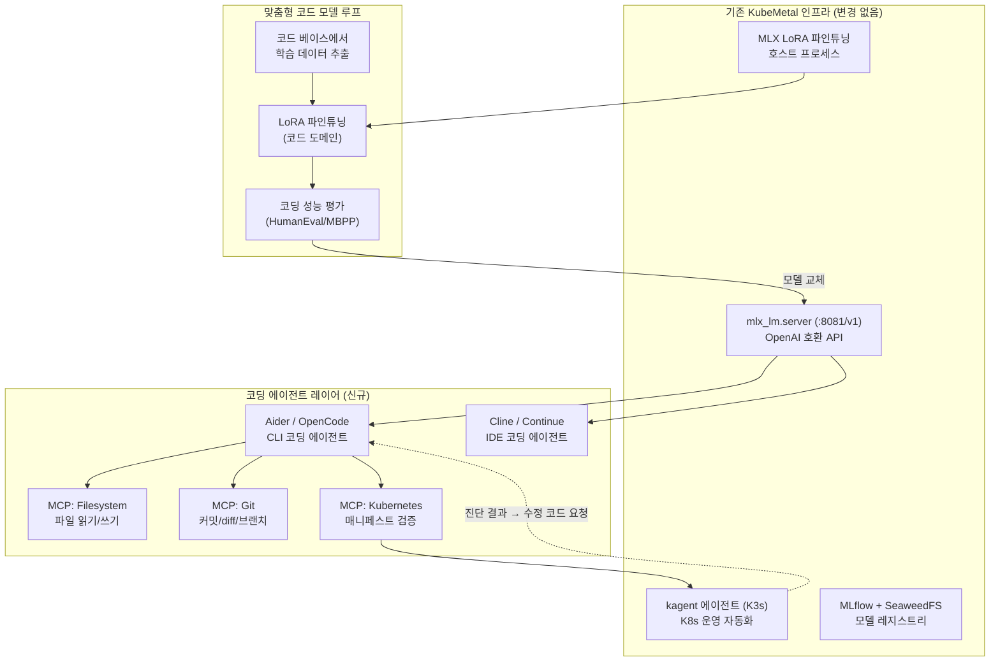
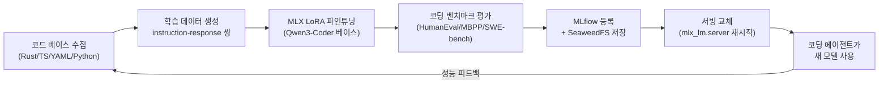
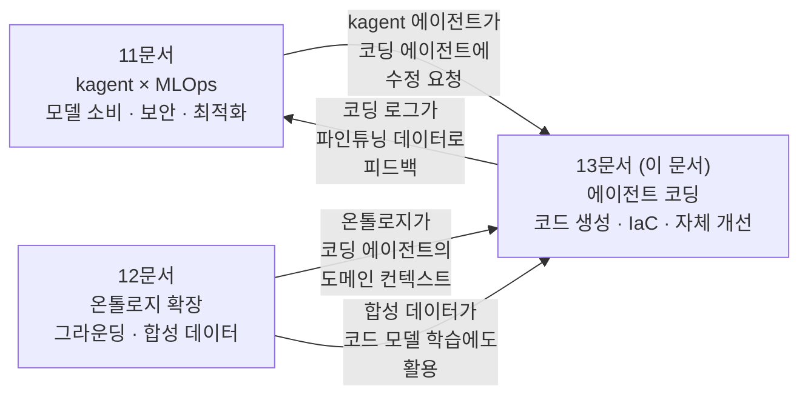

# 13. 에이전트 코딩 활용방안 검토 — KubeMetal × 로컬 코딩 에이전트

> 2026-07-24 · 기반: [11-kagent-mlops-integration.md](11-kagent-mlops-integration.md)(kagent 통합),
> [12-ontology-extended-usage.md](12-ontology-extended-usage.md)(온톨로지 확장), 웹 리서치

## 결론: **KubeMetal의 기존 인프라가 "완전 로컬 코딩 에이전트 플랫폼"으로 자연 확장된다**

KubeMetal은 이미 ① 로컬 LLM 서빙(mlx_lm.server) ② 모델 파인튜닝(MLX LoRA)
③ 도구 연결(kagent + MCP) ④ 파이프라인 오케스트레이션(Prefect)을 갖추고 있다.
여기에 코딩 에이전트 도구(Aider/OpenCode/Cline)와 코드 특화 MCP 서버를 연결하면,
**외부 API 비용 $0 · 코드 유출 0의 자체 코딩 AI 스택**이 완성된다.

> **서빙 포트 표기**: D1의 기본 서빙 포트는 **8080**이며 `suggest_serving_port`가 8080~8099에서 비어 있는 첫 포트를 제안한다. 본 문서의 `:8081`은 08문서 실험에서 8080이 선점돼 있어 실제로 사용된 포트이며, 아키텍처 기본값이 아니다(kagent UI는 8090 — D1 참조).

---

## 1. 에이전트 코딩이 KubeMetal에 주는 세 가지 가치

| 가치 | 설명 |
|------|------|
| **KubeMetal 자체 개발 가속** | 프로젝트의 Rust 백엔드·React 프론트·K8s 매니페스트·Python 스크립트를 로컬 코딩 에이전트가 직접 수정·리뷰·테스트 |
| **K8s 매니페스트/IaC 자동 생성** | kagent와 연계하여 진단 결과 → 수정 매니페스트 YAML 자동 생성 → human-in-the-loop 적용 |
| **도메인 특화 코드 모델** | KubeMetal의 파인튜닝 파이프라인으로 K8s/Rust/TS 도메인 코딩 모델을 자체 제작·서빙 |

---

## 2. 아키텍처 — 기존 인프라 위에 코딩 레이어 추가



**핵심 연결점**: 코딩 에이전트가 기존 `mlx_lm.server`(:8081)의 OpenAI 호환 API를
그대로 사용한다. **추가 인프라 필요 없음**.

---

## 3. 네 가지 활용 시나리오

### 3A. 로컬 코딩 어시스턴트 — 외부 API 대체

**현재**: 개발자가 Claude/GPT API를 사용해 코딩 — 비용 발생 + 코드 외부 전송.

**KubeMetal 기반 대안**:

```
개발자 터미널/IDE
  → Aider/OpenCode/Cline (코딩 에이전트)
    → mlx_lm.server (:8081/v1, OpenAI 호환)
      → 로컬 파인튜닝된 코드 모델 (Qwen3-Coder 계열)
```

| 도구 | 유형 | 로컬 LLM 지원 | KubeMetal 적합성 |
|------|------|-------------|-----------------|
| **Aider** | CLI 기반 Git-native | ✅ OpenAI 호환 base_url 지정 | 🟢 최적 — 터미널 워크플로, human-in-the-loop |
| **OpenCode** | CLI, 75+ 프로바이더 | ✅ Ollama/llama.cpp/OpenAI 호환 | 🟢 최적 — 가장 유연한 로컬 설정 |
| **Cline (Roo Code)** | VS Code 확장 | ✅ OpenAI 호환 커스텀 엔드포인트 | 🟢 IDE 선호자용 |
| **Continue** | IDE 확장 (VS Code/JetBrains) | ✅ 다양한 로컬 백엔드 | 🟢 자동완성 + 채팅 |

**설정 예시 (Aider)**:

```bash
# KubeMetal 서빙 엔드포인트를 Aider에 연결
export OPENAI_API_BASE=http://localhost:8081/v1
export OPENAI_API_KEY=not-needed  # 로컬이므로 더미 키

aider --model openai/qwen3-coder-7b \
      --map-tokens 2048 \
      src/components/mlx/MlxServingCard.tsx \
      src-tauri/src/commands/mlx.rs
```

**권장 코드 모델** (Apple Silicon 기준):

| 모델 | 크기 | 최소 RAM | 특성 |
|------|------|---------|------|
| **Qwen3-Coder-7B-4bit** | ~4GB | 16GB | 범용 코딩, 기본 추천 |
| **Qwen3.5-9B-4bit** | ~5GB | 16GB | 빠른 추론 (~100 tok/s) |
| **Gemma-4-27B-4bit** | ~14GB | 32GB | 추론력 우수, "daily driver" |
| **Qwen3-Coder-32B-4bit** | ~17GB | 64GB | 복잡한 아키텍처 리팩토링 |

### 3B. K8s 매니페스트 · IaC 자동 생성

**kagent 운영 에이전트 + 코딩 에이전트의 협업 시나리오**:

```
① kagent K8s 에이전트: "seaweedfs 파드가 OOM, 현재 limits.memory=1Gi"
  ↓
② 코딩 에이전트에게 전달: "seaweedfs의 메모리 limits를 2Gi로 수정한 YAML 생성"
  ↓
③ 코딩 에이전트:
   - scripts/k8s/seaweedfs.yaml 읽기 (MCP Filesystem)
   - limits.memory: 2Gi로 수정
   - kubectl dry-run으로 검증 (MCP Kubernetes)
   - git diff로 변경 내용 표시 (MCP Git)
  ↓
④ human-in-the-loop: 개발자가 확인 후 적용
```

**필요한 MCP 서버 조합**:

| MCP 서버 | 역할 | 설치 | kagent 연동 |
|----------|------|------|------------|
| `mcp-server-filesystem` | 프로젝트 파일 읽기/쓰기 | npm 패키지 | MCPServer CRD |
| `mcp-server-git` | Git 커밋/diff/로그 | npm 패키지 | MCPServer CRD |
| `mcp-server-kubernetes` | kubectl 래핑 (dry-run, apply, get) | npm 패키지 | 이미 kagent 내장 |
| `mcp-server-helm` | Helm 차트 메타데이터/values 조회 | npm 패키지 | MCPServer CRD |

> [!TIP]
> kagent에 이미 내장된 K8s 도구 + Filesystem MCP를 추가하면 "진단 → 코드 수정 제안"까지 하나의 에이전트가 수행 가능. 별도 코딩 에이전트 프로세스 없이 kagent 에이전트 하나로 통합할 수도 있다.

### 3C. KubeMetal 자체 개발 지원 에이전트

**KubeMetal 프로젝트의 코드베이스를 이해하는 맞춤형 코딩 에이전트 구축.**

현재 프로젝트 구조:

```
kubemetal/
├── src/               # React + TypeScript (프론트엔드)
├── src-tauri/         # Rust (백엔드 — 24개 IPC 커맨드)
├── scripts/k8s/       # K8s 매니페스트 YAML
├── scripts/mlx/       # Python (파인튜닝 래퍼)
└── docs/              # 설계 문서 (D-레지스트리, 온톨로지 등)
```

**에이전트에게 제공할 컨텍스트** (12문서 §2A 온톨로지 그라운딩과 동일 패턴):

```yaml
# 코딩 에이전트 system prompt 요소
1. docs/10-glossary.md  → 엔티티·용어 규칙 (UI 라벨 정합 유지)
2. docs/03-mvp-design.md §4  → D-레지스트리 (설계 결정 근거)
3. docs/mistakes-log.md  → 실수 패턴 (반복 방지)
4. DESIGN.md  → 디자인 시스템 토큰 (UI 컴포넌트 규칙)
5. CLAUDE.md  → 코딩 규칙 (Conventional Commits, 파일 분할 등)
```

**구현**: Aider의 `--read` 옵션 또는 Continue의 `@docs` 인덱싱으로 프로젝트 문서를
상시 컨텍스트로 주입.

```bash
# KubeMetal 개발 전용 Aider 설정
aider --model openai/qwen3-coder-7b \
      --read docs/10-glossary.md \
      --read docs/mistakes-log.md \
      --read DESIGN.md \
      --read CLAUDE.md \
      src/components/mlx/MlxServingCard.tsx
```

### 3D. 도메인 특화 코드 모델 자체 제작

**KubeMetal의 핵심 차별점**: 코딩 에이전트를 단순히 "사용"하는 것이 아니라,
**코딩 모델 자체를 파인튜닝하고 서빙하는 파이프라인을 이미 보유**.



**파인튜닝 데이터 소스**:

| 소스 | 데이터 유형 | 생성 방법 |
|------|-----------|----------|
| **KubeMetal 코드베이스** | Rust IPC 커맨드 구현 패턴, React 컴포넌트 패턴 | Git 히스토리에서 커밋 메시지 → 코드 변경 쌍 추출 |
| **K8s 매니페스트** | YAML 구조, CRD 스키마 | `scripts/k8s/` + 공개 Helm 차트에서 instruction-YAML 쌍 |
| **설계 문서** | D-레지스트리 기반 "왜 이렇게 구현했는가" | docs/ 에서 설계 결정 → 코드 구현 매핑 QA |
| **mistakes-log** | 안티패턴 → 올바른 패턴 | 실수 기록에서 before/after 코드 쌍 |
| **온톨로지 기반 합성** | 12문서 §2B의 KG-SFT 패턴 | 엔티티·관계에서 코드 생성 시나리오 자동 생성 |

> [!IMPORTANT]
> 파인튜닝 vs RAG 판단 기준:
> - **새로운 사실/API 지식** → RAG (docs/를 인덱싱, 이미 Phase 4c)
> - **코딩 스타일/구조적 패턴** → 파인튜닝 (Conventional Commits 준수, DESIGN.md 토큰 사용 등)
> - 둘 다 필요하면 **하이브리드**: 파인튜닝으로 스타일 학습 + RAG로 최신 문서 주입

---

## 4. kagent와의 시너지 — "Ops Agent + Code Agent" 이중 루프

11문서의 kagent 활용과 코딩 에이전트를 결합하면 **두 개의 피드백 루프**가 형성된다:

```
┌─────────────────────────────────────────────────────────┐
│  루프 1: K8s 운영 (11문서)                               │
│  kagent → 장애 진단 → 최적화 제안 → 보안 스캔            │
│      ↓                                                   │
│  루프 2: 코드 자동화 (이 문서)                            │
│  코딩 에이전트 → 매니페스트 수정 → 테스트 → 적용          │
│      ↓                                                   │
│  루프 3: 모델 개선 (11문서 §3C + 12문서 §2B)             │
│  운영/코딩 로그 → 학습 데이터 → 파인튜닝 → 더 나은 모델  │
└─────────────────────────────────────────────────────────┘
```

**구체적 협업 시나리오**:

| 트리거 | kagent (Ops) | 코딩 에이전트 (Code) | 결과 |
|--------|-------------|-------------------|------|
| MLflow 파드 CrashLoopBackOff | 원인 진단: OOM, limits 부족 | `seaweedfs.yaml` 수정 + dry-run 검증 | PR 생성 |
| 보안 스캔: RBAC 과다 권한 | Kubescape 결과 해석 | `ClusterRoleBinding` YAML 수정 | 최소 권한 적용 |
| 새 MCP 도구 필요 | "현재 도구로 X 불가능" 판단 | 커스텀 MCP 서버 Python/Go 코드 생성 | 도구 확장 |
| 프론트엔드 버그 리포트 | — | `MlxServingCard.tsx` i18n 키 누락 수정 (10-glossary 기반) | 감사 위반 해소 |

---

## 5. 구현 로드맵

| 단계 | 범위 | 예상 공수 | 선행 조건 |
|------|------|----------|----------|
| **C1. 코딩 에이전트 연결** | Aider/OpenCode를 mlx_lm.server(:8081)에 연결. 코드 모델(Qwen3-Coder-7B-4bit) 다운로드·서빙 | 2시간 | 서빙 인프라 (이미 존재) |
| **C2. 프로젝트 컨텍스트 구성** | docs/(glossary, D-레지스트리, mistakes-log) + DESIGN.md + CLAUDE.md를 에이전트 상시 컨텍스트로 설정 | 1시간 | C1 |
| **C3. MCP 도구 추가** | Filesystem + Git MCP 서버를 kagent MCPServer CRD로 등록. kagent 에이전트가 파일 편집 가능 | 반나절 | 11문서 5a (kagent 정식 편입) |
| **C4. K8s 매니페스트 생성 에이전트** | kagent에 `manifest-gen-agent` CRD 추가: 진단 → YAML 생성 → dry-run → diff 출력 | 1일 | C3 |
| **C5. 코드 모델 파인튜닝** | KubeMetal 코드베이스 + K8s YAML에서 instruction-response 쌍 500~2000개 추출 → LoRA | 2~3일 | C1 + 파인튜닝 인프라 (이미 존재) |
| **C6. IDE 연동** | Continue/Cline VS Code 확장에 로컬 엔드포인트 설정 + 자동완성/채팅 | 1시간 | C1 |

---

## 6. 리스크

| 리스크 | 영향 | 완화 |
|--------|------|------|
| **7B 코드 모델 품질 한계** | 복잡한 리팩토링·멀티파일 변경에서 실패 가능 | 27B+(64GB 호스트)로 승격, 또는 파인튜닝으로 도메인 정확도 보상. human-in-the-loop 필수 유지 |
| **컨텍스트 윈도우 부족** | Rust 백엔드 파일(300줄+)을 여러 개 동시에 다루면 컨텍스트 초과 | Aider의 repo-map으로 요약 주입 + 필요 파일만 선택적 로드. 32k+ 컨텍스트 모델 권장 |
| **자동 적용 위험** | 코딩 에이전트가 잘못된 YAML을 `kubectl apply` | **dry-run 필수** + human-in-the-loop. kagent `HumanInTheLoop` CRD 활용 |
| **서빙 모델 충돌** | kagent용 범용 모델 vs 코딩용 코드 모델이 동시 필요 | 포트 분리: 범용(:8081) + 코드(:8082). 또는 vllm-metal(멀티모델) 승격 시점에 해결 |
| **파인튜닝 데이터 저작권** | 공개 코드로 학습 시 라이선스 이슈 | 자체 코드베이스(MIT 예정) + 합성 데이터 중심. 공개 데이터셋(The Stack v2 등)은 라이선스 필터 적용 |

---

## 7. 경쟁 우위 — "코딩 에이전트를 만드는 코딩 에이전트"

```
일반적인 코딩 에이전트 사용:
  외부 API (Claude/GPT) → 코드 생성 → 적용
  문제: 비용 발생, 코드 외부 유출, 도메인 지식 없음

KubeMetal 접근:
  자체 파인튜닝 코드 모델 → 로컬 서빙 → 코딩 에이전트 → 적용
  + kagent가 K8s 운영 진단 → 코딩 에이전트에 수정 요청 → 자동 PR
  + 코딩 로그 → 파인튜닝 데이터 → 더 나은 코드 모델
  → "자기 자신을 개선하는 개발 환경"
```

| 비교 대상 | KubeMetal 차별점 |
|----------|-----------------|
| GitHub Copilot / Cursor | 클라우드 API 의존, 코드 외부 전송. KubeMetal은 완전 로컬 |
| Aider + Ollama (단독) | 모델만 로컬. 파인튜닝·평가·레지스트리·파이프라인 없음 |
| Cody (Sourcegraph) | 엔터프라이즈 서버 필요. KubeMetal은 데스크톱 단독 |
| kagent 단독 | K8s 운영만. 코드 수정·생성 불가 |

---

## 8. 11·12문서와의 통합 관계



---

## 9. 요약

> KubeMetal은 "코딩 에이전트를 사용하는" 것에 그치지 않고, **코딩 모델을 만들고 · 서빙하고 · 
> K8s 운영과 연결하고 · 피드백으로 개선하는 전체 루프**를 로컬에서 완결한다.

| 활용 시나리오 | 가능 여부 | 추가 비용 | 핵심 이점 |
|-------------|----------|----------|----------|
| 로컬 코딩 어시스턴트 (3A) | ✅ 즉시 | 🟢 모델 다운로드만 | 외부 API $0, 코드 유출 0 |
| K8s 매니페스트 자동 생성 (3B) | ✅ 가능 | 🟡 MCP 서버 설정 | kagent 진단 → 수정 코드 자동 |
| 프로젝트 전용 코딩 에이전트 (3C) | ✅ 가능 | 🟢 컨텍스트 설정 | 온톨로지·D-레지스트리 인식 개발 |
| 도메인 코드 모델 자체 제작 (3D) | ✅ 가능 | 🟡 데이터 구축 1~3일 | 자기 개선 루프 — 다른 도구에 없는 것 |
