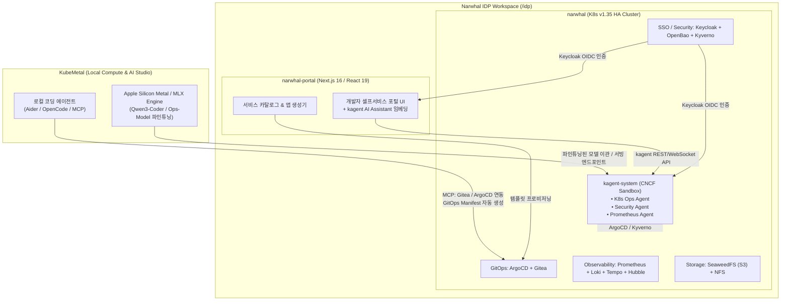
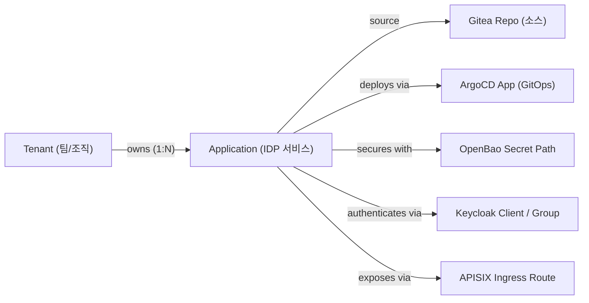

# 14. Narwhal IDP 클러스터 적용 및 연계 방안 검토 — kagent · IDP 온톨로지 · AI 코딩 · 하이브리드 MLOps

> 2026-07-24 · 대상: Narwhal IDP 리포지터리 — 별도 로컬 프로젝트 (Narwhal K8s IDP + Narwhal-Portal)
> 기반: [11-kagent-mlops-integration.md](11-kagent-mlops-integration.md), [12-ontology-extended-usage.md](12-ontology-extended-usage.md), [13-agent-coding-review.md](13-agent-coding-review.md)

> **서빙 포트 표기**: D1의 기본 서빙 포트는 **8080**이며 `suggest_serving_port`가 8080~8099에서 비어 있는 첫 포트를 제안한다. 본 문서의 `:8081`은 08문서 실험에서 8080이 선점돼 있어 실제로 사용된 포트이며, 아키텍처 기본값이 아니다(kagent UI는 8090 — D1 참조).

---

## 결론: **KubeMetal의 AI/에이전트 기술을 Narwhal IDP에 적용하면 "AI-Driven Autonomous IDP"로 진화한다**

Narwhal IDP는 **Enterprise급 K8s 1.35 HA 클러스터**(ArgoCD, Gitea, Keycloak OIDC, Prometheus/Loki/Tempo, Istio, OpenBao, Kyverno, SeaweedFS)와 **Next.js 16 관리 포털(Narwhal-Portal)**이 이미 탄탄하게 구축되어 있다.

KubeMetal에서 검토·실증한 **kagent(에이전틱 운영), IDP 온톨로지(도메인 지식), AI 코딩 에이전트(IaC/앱 생성), 로컬 MLX 파인튜닝 모델**을 Narwhal IDP에 이식 및 연계하면, **Self-Service 개발자 포털과 셀프힐링 AI Ops가 결합된 완전체 IDP**를 완성할 수 있다.

---

## 1. Narwhal IDP ↔ KubeMetal 구조 비교 및 통합 역할



---

## 2. 4대 영역별 Narwhal IDP 적용 상세 방안

### 2A. kagent 기반 AI-SRE & Platform Agent (K8s 운영 자동화)

**Narwhal의 풍부한 관측성/보안 스택(Prometheus, Loki, ArgoCD, Kyverno)은 kagent의 최적 놀이터다.**

* **배치 방식**: Narwhal 클러스터의 `kagent-system` 네임스페이스에 kagent CRD 및 컨트롤러 설치.
* **Keycloak OIDC 연동**: Narwhal의 Keycloak과 kagent UI/API를 연동하여 RBAC 기반 SSO 로그인 적용.
* **MCP 서버 연결**:
  * **Prometheus MCP**: Prometheus 메트릭 이상 탐지 및 promql-agent 활성화.
  * **ArgoCD / Gitea MCP**: GitOps 동기화 실패 및 Rollout 파일 병목 자동 분석.
  * **Kyverno / Kubescape MCP**: 클러스터 보안 위반 사항 및 Policy fail 원인 분석.

```yaml
# Narwhal IDP kagent Agent CRD 예시
apiVersion: kagent.dev/v1alpha1
kind: Agent
metadata:
  name: narwhal-sre-agent
  namespace: kagent-system
spec:
  modelProvider:
    ref: local-mlx-provider # KubeMetal 또는 내장 vLLM 서빙
  systemPrompt: |
    너는 Narwhal IDP 클러스터(K8s v1.35)의 전문 AI-SRE 에이전트다.
    ArgoCD App-of-Apps 구조, Keycloak OIDC, Istio Ambient Mode, Kyverno Policy를 완벽히 이해한다.
  tools:
    - name: k8s-tool
    - name: prometheus-mcp
    - name: argocd-mcp
    - name: kubescape-mcp
```

### 2B. Narwhal-Portal (Next.js 16)과 AI 코딩 & IaC 생성 연동

**Narwhal-Portal에서 개발자가 클릭 한 번으로 새 서비스를 신청할 때, AI 코딩 에이전트가 GitOps 리포지토리(Gitea)에 YAML을 자동 생성한다.**

1. **AI 기반 앱 스캐폴딩 (App Scaffolding)**:
   * 개발자가 포털에서 "Node.js REST API + PostgreSQL 서비스 생성"을 요청.
   * 백엔드( 또는 코딩 에이전트 MCP)가 Gitea 리포지토리에 Helm Chart / KubeManifest / ArgoCD Application YAML을 자동 생성 후 커밋.
2. **AI 대화형 포털 조율사 (Portal Chatbot)**:
   * Narwhal-Portal 우측 하단에 kagent 연동 AI 대화 창 임베딩.
   * "내 파드 로그 보여줘", "ArgoCD 앱 동기화 안 되는 이유가 뭐야?", "Database 비밀번호 재발급해줘(OpenBao 연동)" 요청을 자연어로 처리.

### 2C. IDP 온톨로지(IDP Domain Ontology) 구축

**`narwhal` (인프라/K8s)과 `narwhal-portal` (포털 서비스) 간의 개념적 불일치를 해결하고 에이전트에 IDP 도메인 지식을 주입.**

`idp/CLAUDE.md`에 언급된 **Seam Contract**(cross-repo coherence)를 온톨로지로 명시:



* **에이전트 그라운딩**: 이 온톨로지를 kagent와 포털 코딩 에이전트에 주입하여, "Tenant A의 Secret이 변경되면 어떤 ArgoCD App과 APISIX Route에 영향을 미치는지" 연쇄 추론(Blast Radius Analysis) 가능.
* **Cross-Repo 정합성 감사**: `idp-cross-orchestrator` 스킬이 이 온톨로지 규칙을 바탕으로 `narwhal/`과 `narwhal-portal/` 간의 명세 이탈(Drift)을 자동 감사.

### 2D. 하이브리드 MLOps & 모델 배포 연계

**KubeMetal의 Metal GPU 연산 능력과 Narwhal IDP의 엔터프라이즈 운영 환경을 하이브리드로 결합.**

1. **모델 개발 및 파인튜닝 (KubeMetal / 호스트 MLX)**:
   * Narwhal IDP 전용 **K8s-Ops & IaC 특화 코드 모델**(Qwen3-Coder 기반)을 KubeMetal의 MLX Studio에서 파인튜닝.
2. **아티팩트 및 레지스트리 공유**:
   * 파인튜닝된 모델 어댑터/가중치를 Narwhal 클러스터 내 **SeaweedFS S3 버킷**으로 자동 업로드 및 MLflow에 등록.
3. **IDP 내 서빙 / 호스트 하이브리드 서빙**:
   * 로컬 데스크톱 개발 시: KubeMetal 호스트 서빙(`:8081`)을 Narwhal 클러스터 파드들이 ExternalName(`mac-gpu-service`)으로 이용.
   * 운용/원격 확장 시: Narwhal 클러스터 내 vLLM / KAITO / KServe 파드로 모델 이관 배포.

---

## 3. 구현 로드맵 (IDP 연계 Phase)

| 단계 | 목표 | 주요 작업 | 예상 공수 |
|------|------|----------|----------|
| **IDP-1. kagent 이식** | Narwhal 클러스터에 kagent 배포 | `kagent-system` ns 프로비저닝, Prometheus/ArgoCD MCP 연결, Keycloak OIDC 연동 | 1일 |
| **IDP-2. IDP 온톨로지 작성** | Narwhal IDP 지식 척추 정의 | `idp/docs/ontology.md` 작성 (Tenant-App-Argo-Bao-KC 관계도), kagent prompt 인라인 | 반나절 |
| **IDP-3. Portal AI Assistant** | Narwhal-Portal에 kagent 챗 UI 결합 | Next.js 포털 UI 컴포넌트 추가, kagent WebSocket/REST API 호출 연동 | 1~2일 |
| **IDP-4. GitOps AI 코딩 스캐폴딩** | 포털 앱 신청시 AI YAML 자동 생성 | Gitea/ArgoCD MCP + Aider/OpenCode 연동 스크립트 작성 | 2일 |
| **IDP-5. Ops/IaC 특화 모델 파인튜닝** | Narwhal IDP 전용 맞춤형 AI 구축 | Narwhal GitOps YAML + K8s 1.35 매니페스트로 Qwen3-Coder 파인튜닝 → SeaweedFS 등록 | 2~3일 |

---

## 4. 요약

> **KubeMetal**(로컬 MLOps/파인튜닝/서빙 엔진)과 **IDP(Narwhal)**(Enterprise K8s infrastructure + Portal)의 만남은, **"로컬 Apple Silicon GPU의 무료 연산력으로 Narwhal IDP 클러스터를 제어하고 자동화하는 차세대 AI-Native IDP"**를 완성시킨다.
