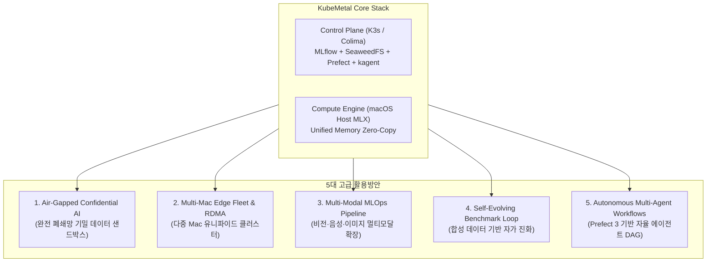
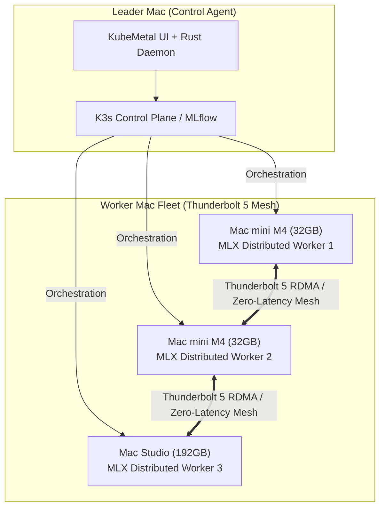
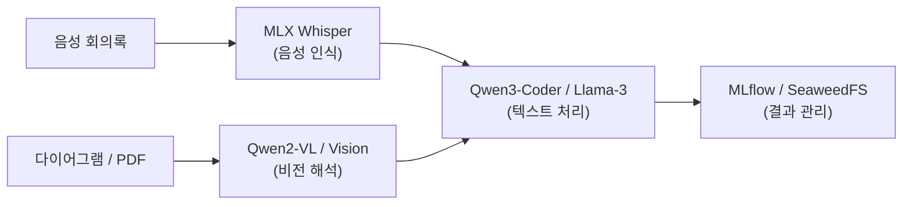
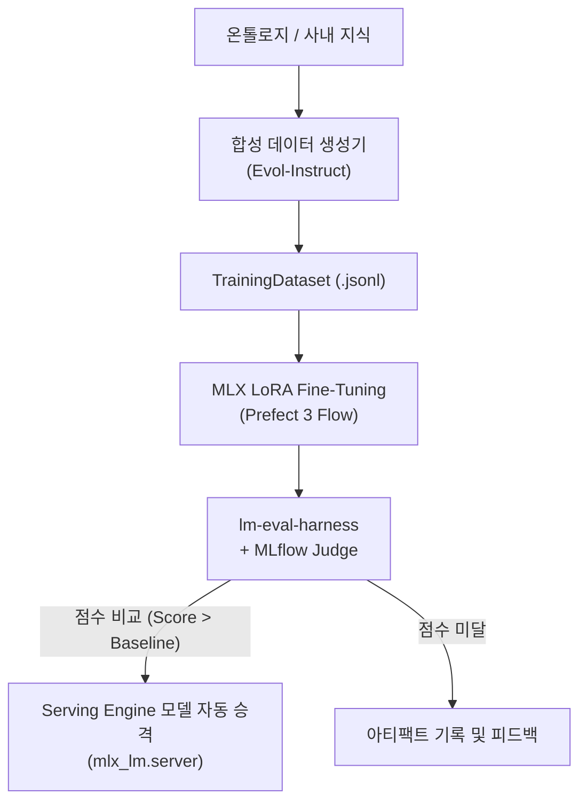

# 15. KubeMetal 고급 활용방안 리서치 — 기밀 AI 샌드박스 · 멀티 Mac 플릿 · 멀티모달 MLOps · 자가 진화 루프

> 2026-07-24 · 작성: Antigravity AI
> 기반: [01-proposal.md](01-proposal.md), [08-kagent-feasibility.md](08-kagent-feasibility.md), [11-kagent-mlops-integration.md](11-kagent-mlops-integration.md), [13-agent-coding-review.md](13-agent-coding-review.md), [14-idp-integration-review.md](14-idp-integration-review.md)

> **서빙 포트 표기**: D1의 기본 서빙 포트는 **8080**이며 `suggest_serving_port`가 8080~8099에서 비어 있는 첫 포트를 제안한다. 본 문서의 `:8081`은 08문서 실험에서 8080이 선점돼 있어 실제로 사용된 포트이며, 아키텍처 기본값이 아니다(kagent UI는 8090 — D1 참조).

---

## 개요

본 문서는 KubeMetal의 핵심 아키텍처 불변식(**제어면 = K8s/Colima, 연산 = macOS 호스트 MLX**)과 구축된 MLOps/kagent/온톨로지/코딩 에이전트 인프라를 바탕으로, 차세대 기업 및 개발 환경에 적용 가능한 **5대 고도화 활용 방안**을 리서치하고 실행 가능성을 검토합니다.

---

## 1. 5대 고급 활용방안 요약



---

## 2. 활용방안별 상세 분석

### 2A. Air-Gapped Confidential AI & Enterprise Data Sandbox (완전 폐쇄망 기밀 AI 샌드박스)

**배경 및 목적**:
금융, 의료, 법률, 국방, 첨단 R&D 등 **외부 API(OpenAI/Claude) 전송 및 외부 인터넷 통신이 완전히 금지된(Air-gapped)** 극도의 보안 환경에서, 데이터 유출 위험 $0의 온프레미스 AI 워크스페이스 제공.

**핵심 아키텍처**:
* **네트워크 차단**: 외부 연결이 거부된 순수 로컬/내부망 동작.
* **PII & Security Masking Filter**: 입력 프롬프트 및 문서 인덱싱 전 PII(개인식별정보), 비밀번호, 민감 키를 로컬 마스킹 필터(Presidio 등)로 1차 정제.
* **로컬 RAG & 데이터 샌드박스**: LanceDB/Qdrant 파드를 통한 로컬 기밀 문서 인덱싱 + SeaweedFS S3 암호화 저장.
* **로컬 MLX 서빙/파인튜닝**: 외부 통신 없이 호스트 MLX 프로세스로만 서빙 및 LoRA 학습 수행.


| 이점 | 비고 |
|------|------|
| **완전한 데이터 주권 (Data Sovereignty)** | GDPR, HIPAA, 금융보안원 가이드라인 100% 충족 |
| **비용 제로 ($0)** | 토큰 당 비용 및 클라우드 GPU 전송료 소모 없음 |

---

### 2B. Multi-Mac Edge Fleet & Thunderbolt 5 RDMA Cluster (다중 Mac 엣지 클러스터 제어)

**배경 및 목적**:
단일 Mac의 유니파이드 메모리 한계(예: 16GB~64GB)를 넘어, 사무실/연구실 내 여러 대의 Mac mini/Mac Studio를 KubeMetal 제어면 아래 하나로 묶어 **초대형 모델(100B+ / DeepSeek-R1 등)** 분산 추론 및 엣지 플릿 제어.

**핵심 기술**:
* **Thunderbolt 5 RDMA / Distributed MLX**: macOS 26.2+ 기반 Thunderbolt 메모리 쉐어링 및 MLX Distributed Inference 기능 활용.
* **K3s Multi-Node / KubeFleet Control Agent**: KubeMetal의 Control Agent가 여러 Mac의 K3s 노드를 중앙 오케스트레이션하여 워크로드 분배.



---

### 2C. Multi-Modal Local MLOps Pipeline (비전·음성·이미지 멀티모달 파이프라인)

**배경 및 목적**:
텍스트 LLM에만 국한되지 않고, Apple MLX 에코시스템에 최적화된 **음성(Whisper), 비전 언어(Qwen2-VL, Llama-3.2-Vision), 이미지 생성(FLUX, Stable Diffusion)** 모델까지 MLOps 수명주기에 포함.

**사용 시나리오**:
1. **음성 회의록 자동 처리**: 회의 음성 파일 입력 -> MLX-Whisper로 로컬 텍스트 변환 -> LLM 요약 -> MLflow 기록.
2. **비전 기반 다이어그램/문서 해석**: K8s 아키텍처 다이어그램/스캔 PDF 입력 -> Qwen2-VL 모델로 구조 파악 -> K8s YAML 생성.
3. **이미지/차트 자동 생성**: MLX-FLUX 파이프라인을 통해 파이프라인 가시화 차트 또는 보고서용 시각 자료 생성.



---

### 2D. Synthetic Data & Self-Evolving Benchmark Loop (합성 데이터 기반 자가 진화 파인튜닝)

**배경 및 목적**:
사람의 수동 데이터 구축 없이, 대형 모델 또는 온톨로지 기반으로 고품질 합성 데이터(Evol-Instruct, QA 쌍)를 생성하고 소형 모델을 연속 파인튜닝/평가하여 스스로 성능을 높이는 **Self-Evolving MLOps Loop**.

**작동 순서**:
1. **데이터 합성**: 대형 모델(또는 [12-ontology-extended-usage.md](12-ontology-extended-usage.md) 온톨로지)이 도메인 시나리오 및 QA 합성 데이터셋(.jsonl) 자동 생성.
2. **자동 파인튜닝**: Prefect 3가 트리거되어 호스트 MLX에서 Target 소형 모델(Qwen3-Coder-7B) LoRA 파인튜닝 실행.
3. **자동 벤치마크 평가**: `lm-eval-harness` 및 MLflow GenAI Evaluator(LLM-as-a-Judge)가 성능 측정.
4. **자동 승격 배포**: 이전 버전 대비 평가 점수(MMLU, Pass@1 등)가 우수할 경우, `mlx_lm.server` 엔진의 모델을 신규 버전으로 자동 교체.



---

### 2E. Autonomous Multi-Agent Workflows via Prefect 3 (자율적 멀티 에이전트 DAG)

**배경 및 목적**:
단순 스케줄링을 넘어, KubeMetal의 Prefect 3 서버와 kagent, 코딩 에이전트를 조율하여 **복잡한 엔드투엔드 파이프라인을 자율 처리하는 멀티 에이전트 DAG** 구축.

**예시 DAG 파이프라인 (자동 클러스터 헬스 리포트 & 자동 패치)**:
```
[1. kagent 스캔] -> [2. Kubescape 보안 스캔] -> [3. 이상 항목 수집]
       |
       v
[4. 코딩 에이전트 YAML 패치 작성] -> [5. dry-run 검증] -> [6. PR/Slack 알림]
```

---

## 3. 고급 활용방안 비교 및 요구사항

| 활용방안 | 주요 대상 | 추가 필요 구성요소 | 기술적 난이도 |
|----------|-----------|-------------------|--------------|
| **2A. Air-Gapped 기밀 AI** | 금융/의료/국방/기업 R&D | PII Masking Filter (Presidio) | 🟢 낮음 (즉시 적용 가능) |
| **2B. Multi-Mac RDMA Cluster** | 대규모 연구소/SMB 서버 룸 | Thunderbolt 5 케이블 + macOS 26.2+ | 🟠 중간~높음 (하드웨어 필요) |
| **2C. Multi-Modal MLOps** | 멀티미디어/문서 분석 팀 | mlx-whisper, mlx-vlm 패키지 | 🟡 중간 |
| **2D. Self-Evolving Loop** | AI/MLOps 파이프라인 팀 | Prefect 3 + lm-eval + MLflow Judge | 🟡 중간 (Phase 4b 연계) |
| **2E. Autonomous Agent DAG** | DevOps / Platform 엔지니어링 | Prefect 3 + kagent + MCP | 🟡 중간 (Phase 4a 연계) |

---

## 4. 결론 및 제안 로드맵

KubeMetal은 단순한 "로컬 서빙 도구"를 넘어, **개인 정보 보호(Air-Gapped Confidential AI)**, **다중 Mac 유니파이드 클러스터(Multi-Mac Edge Fleet)**, **멀티모달 MLOps**, **자가 진화 파인튜닝 루프**를 완벽하게 담아낼 수 있는 강력한 하이브리드 인프라 기반을 갖추고 있습니다.

* **1단계 (즉시 실행 가능한 소프트웨어 확장)**:
  1. `2A. Air-Gapped Confidential AI` (로컬 PII 마스킹 + 완전 차단 설정)
  2. `2D. Self-Evolving Benchmark Loop` (Phase 4b lm-eval + Prefect 3 연결)
* **2단계 (기능 고도화 및 하드웨어 확장)**:
  1. `2C. Multi-Modal MLOps` (MLX Whisper / Vision 연동)
  2. `2B. Multi-Mac Edge Fleet` (다중 Mac Thunderbolt RDMA 연동)
