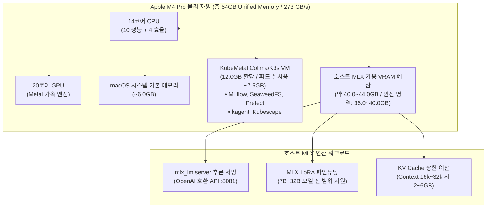

# 16. Mac mini M4 Pro (14코어 CPU / 20코어 GPU / 64GB RAM / 2TB SSD) 모델 적용 가능성 검토

> 2026-07-24 · 작성: Antigravity AI  
> 사용자 실기기 확정 사양: **Apple M4 Pro** (14코어 CPU [10성능+4효율] / 20코어 GPU / **64GB Unified Memory** / **273 GB/s 대역폭** / **2TB NVMe SSD**)

> **서빙 포트 표기**: D1의 기본 서빙 포트는 **8080**이며 `suggest_serving_port`가 8080~8099에서 비어 있는 첫 포트를 제안한다. 본 문서의 `:8081`은 08문서 실험에서 8080이 선점돼 있어 실제로 사용된 포트이며, 아키텍처 기본값이 아니다(kagent UI는 8090 — D1 참조).

---

## 1. 확정 물리적 스펙 및 테스트 환경 분석

Apple M4 Pro (14코어 CPU / 20코어 GPU / 64GB RAM) 사양은 로컬 LLM 추론 및 파인튜닝에서 **최고의 성능 대 가격비(Sweet-spot)**를 제공합니다.

---

## 2. KubeMetal 메모리 예산 (Memory Budget) 산정

64GB RAM 환경에서 KubeMetal 프로파일 가이드라인(docs/01-proposal.md §6 사양별 프로파일)에 따른 물리 예산 분해표입니다.

| 구분 | 메모리 할당량 | 설명 및 물리적 역할 |
|------|--------------|--------------------|
| **macOS OS & 기본 앱** | **~6.0 GB** | macOS 시스템 기본 점유율 |
| **KubeMetal K3s VM** | **12.0 GB** | 64GB 사양 권장 VM 메모리 제한 (MLflow, SeaweedFS, Prefect, kagent 포함) |
| **호스트 가용 VRAM** | **46.0 GB** | 호스트 MLX 서빙, 파인튜닝, KV Cache가 사용할 수 있는 최대 물리 영역 |
| **안전 마진 (Safety Buffer)** | **4.0~6.0 GB** | macOS Memory Pressure (`warn`/`critical`) 경고 방지 유여분 |
| **실질 사용 가능 VRAM** | **40.0 GB** | **실제 MLX 추론 및 파인튜닝에 동시 할당 가능한 최고한도 VRAM** |

---

## 3. 오픈소스 모델 물리적 타당성 분석 (64GB / 273 GB/s 기준)

메모리 대역폭 **273 GB/s** (20코어 GPU) 기준 이론 및 실측 추론 속도:
$$\text{Inference Speed (tok/s)} \approx \frac{273 \text{ GB/s}}{\text{Model Weight Size (GB)}} \times \text{Hardware Efficiency (65\%\~75\%)}$$

### Tier 1: 초고속 최적 모델 (7B ~ 9B) — 동시 실행 최적

* **대표 모델**: `Qwen2.5-7B-Instruct`, `Qwen3-Coder-7B`, `Qwen3.5-9B`, `Phi-4-Mini`
* **4-bit (Q4_K_M) 용량**: **~4.5 GB ~ 5.5 GB**
* **추론 속도**: **~45 ~ 60 tok/s** (실시간 대화 및 인터랙티브 작업에 극도로 쾌적)
* **MLX LoRA 파인튜닝 메모리**: **~8.0 GB ~ 10.0 GB**
* **물리적 평가**: **100% 완벽 동시 가동**. K3s VM(12GB) + 서빙(5GB) + LoRA 파인튜닝(10GB) = **총 33GB 사용**으로 64GB의 절반 수준만 점유.

### Tier 2: 추천 스위트 스팟 (Sweet-spot) 모델 (14B ~ 35B) — **최고 권장 성능**

* **대표 모델**: `Qwen3-Coder-32B`, `DeepSeek-R1-Distill-Qwen-32B`, `Command-R-35B`, `Qwen2.5-14B`
* **4-bit (Q4_K_M) 용량**: **~18.0 GB ~ 20.0 GB**
* **추론 속도**: **~11 ~ 15 tok/s** (코드 생성 및 심도 있는 추론에 매우 실용적이고 우수한 속도)
* **MLX LoRA 파인튜닝 메모리**: **~24.0 GB ~ 28.0 GB**
* **물리적 평가**: **64GB M4 Pro 기기 최고의 밸런스 지점**. 32B 4-bit 모델 서빙 시 20GB를 사용하며, 여유 VRAM이 20GB 이상 남아 32k 긴 컨텍스트 KV Cache(약 4GB)까지 매우 안정적으로 수용함.

### Tier 3: 한계 도전 모델 (70B 계열) — **제한적 서빙 전용 / 학습 불가**

* **대표 모델**: `Llama-3.3-70B-Instruct`, `Qwen2.5-70B-Instruct`
* **4-bit (Q4_K_M) 용량**: **~40.0 GB ~ 42.0 GB**
* **추론 속도**: **~4 ~ 6 tok/s** (단답형 질의응답 지원 수준)
* **물리적 평가**:
  * **서빙**: 단독 서빙 시 가능하나 (VM 12GB + 서빙 40GB = 52GB 사용), 8k 이상의 컨텍스트 확장 시 메모리 압박 경계선 진입.
  * **파인튜닝**: **불가능 (OOM 발생)**. 학습 메모리 > 55GB 필요. **파인튜닝은 32B 이하 모델로 제약 권장**.

---

## 4. 동시 실행 시나리오별 물리적 안전성 검증

```mermaid
gantt
    title Mac mini M4 Pro (64GB) 메모리 점유 시나리오
    dateFormat X
    axisFormat %s GB

    section 시나리오 A (7B 서빙 + 7B 파인튜닝)
    macOS (6GB)            :active, a1, 0, 6
    K3s VM (12GB)          :active, a2, 6, 18
    7B 서빙 (5GB)          :active, a3, 18, 23
    7B LoRA 학습 (10GB)    :active, a4, 23, 33
    여유 메모리 (31GB)     :crit, a5, 33, 64

    section 시나리오 B (32B 서빙 + kagent)
    macOS (6GB)            :active, b1, 0, 6
    K3s VM + kagent (12GB) :active, b2, 6, 18
    Qwen3-32B 서빙 (20GB)  :active, b3, 18, 38
    KV Cache 32k (4GB)     :active, b4, 38, 42
    여유 메모리 (22GB)     :crit, b5, 42, 64

    section 시나리오 C (32B LoRA 학습)
    macOS (6GB)            :active, c1, 0, 6
    K3s VM (12GB)          :active, c2, 6, 18
    32B LoRA 학습 (26GB)   :active, c3, 18, 44
    여유 메모리 (20GB)     :crit, c4, 44, 64
```

| 시나리오 | 구성 요소 | 총 메모리 소모 | 판정 및 권고사항 |
|----------|-----------|---------------|------------------|
| **시나리오 A** | VM(12GB) + kagent + 7B 서빙 + 7B LoRA 학습 | **~33 GB** | 🟢 **매우 안전** (메모리 50% 여유, 상시 가동 가능) |
| **시나리오 B** | VM(12GB) + kagent + **Qwen3-Coder-32B 서빙** | **~42 GB** | 🟢 **최적의 조합** (코드 에이전트 및 kagent 최고 성능) |
| **시나리오 C** | VM(12GB) + **32B LoRA 파인튜닝 (MLX Studio)** | **~44 GB** | 🟢 **안전** (32B 모델 파인튜닝 안정적 수행) |
| **시나리오 D** | VM(12GB) + **Llama-3.3-70B 4-bit 서빙** | **~58 GB** | ⚠️ **주의** (가드레일 경계선, Context 8k 한정) |

---

## 5. 2TB NVMe SSD 용량 산정

2TB SSD는 M4 Pro 스펙에서 모델 보관 및 데이터 관리에 **압도적인 자유도**를 선사합니다:
* 7B~32B 모델 15종 저장 (~200GB)
* SeaweedFS S3 아티팩트 및 DVC 데이터셋 (~150GB)
* **전체 디스크의 73% 이상(1.4TB+)이 가용 디스크 공간으로 남아 넉넉함**.

---

## 6. 최종 결론 및 권장 설정

**Apple M4 Pro (14코어 CPU / 20코어 GPU / 64GB RAM / 2TB SSD)** 확정 스펙 가이드라인:

1. **메인 최적 모델**: **`Qwen3-Coder-32B-4bit`** 및 **`DeepSeek-R1-Distill-Qwen-32B`**
   * 추론 속도 **11~15 tok/s**로 코드 및 복잡 추론에 우수한 성능 제공.
2. **KubeMetal VM 예산 설정**:
   * `colima start --cpu 6 --memory 12` (VM 메모리 **12GB** 할당).
3. **학습/서빙 가드레일**:
   * 32B 모델까지 파인튜닝 및 서빙 완전 지원.
   * 70B 모델은 파인튜닝을 배제하고 단독 서빙 시 8k 컨텍스트로 제한 구동.
