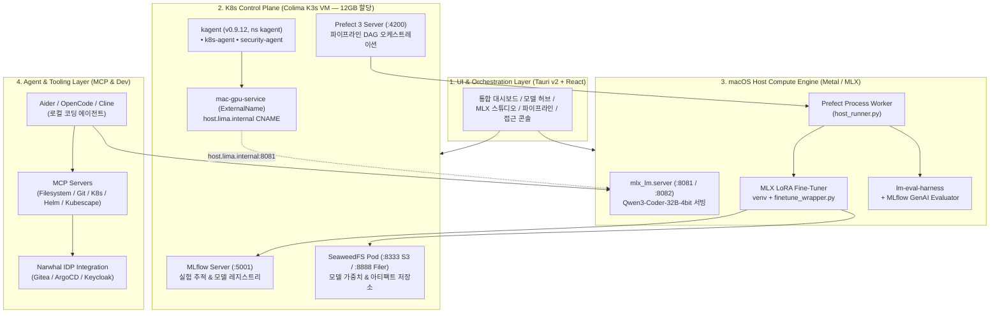
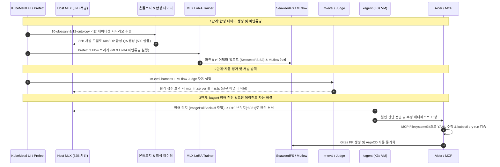

# 17. 실현 가능한 종합 테스트 구성환경 및 E2E 아키텍처 예측

> 2026-07-24 · 작성: Antigravity AI  
> 기반: [01-proposal.md](01-proposal.md) ~ [16-mac-mini-m4-pro-64gb-model-feasibility.md](16-mac-mini-m4-pro-64gb-model-feasibility.md) 전체 검토 및 실측 종합

> **서빙 포트 표기**: D1의 기본 서빙 포트는 **8080**이며 `suggest_serving_port`가 8080~8099에서 비어 있는 첫 포트를 제안한다. 본 문서의 `:8081`은 08문서 실험에서 8080이 선점돼 있어 실제로 사용된 포트이며, 아키텍처 기본값이 아니다(kagent UI는 8090 — D1 참조).

---

## 1. 개요 및 하드웨어 토대 (Hardware Baseline)

본 문서는 Apple M4 Pro 실기기 사양 및 KubeMetal/kagent/온톨로지/코딩 에이전트/IDP 검토 결과를 종합하여, **실제 단일 Mac 데스크톱 환경에서 가동 가능한 최적의 종합 E2E 테스트 구성환경**을 정의합니다.

### 타겟 하드웨어 및 메모리 파티셔닝

* **하드웨어**: Apple M4 Pro (14코어 CPU [10P+4E] / 20코어 GPU / **64GB Unified Memory** / 273 GB/s 대역폭 / **2TB NVMe SSD**)
* **실시간 메모리 파티셔닝 구조**:

```
[총 64 GB Unified Memory]
├── macOS OS & 백그라운드 기본 자원    :  6.0 GB (안정 유지)
├── KubeMetal K3s VM (Colima `vz`)    : 12.0 GB (Colima 메모리 제한 고정)
│   ├── MLflow (5001) + SeaweedFS (8333/8888) + Prefect 3 (4200)
│   └── kagent-system (0.9.12) + Kubescape
└── 호스트 MLX 가용 VRAM 영역        : 46.0 GB (산술 잔여분, 실질 가용 40GB)
    ├── mlx_lm.server 추론 서빙      : 19.0 GB (Qwen3-Coder-32B 4-bit)
    ├── MLX LoRA 파인튜닝 동시 가동   : 15.0 GB (7B 모델 학습 시)
    └── KV Cache 및 안전 여유분      :  6.0 GB (Context 32k 지원)
```

> **16문서와의 수치 정합**: 위 46.0 GB는 `64 − 6(OS) − 12(VM)`의 **산술 잔여분**이고,
> [16문서](16-mac-mini-m4-pro-64gb-model-feasibility.md)의 "약 40.0~44.0 GB"는 여기서
> 페이지 캐시·GPU 드라이버 오버헤드를 추가로 뺀 **실사용 추정치**다. 두 문서가 공통으로
> 보수적 상한으로 쓰는 값은 **40 GB**(16문서 안전 영역 36~40 GB의 상단)이므로, 모델
> 배치 계획은 46 GB가 아니라 40 GB를 기준으로 세운다. 어느 쪽도 실측이 아니며
> 실기기 계측으로 확정해야 하는 항목이다.

---

## 2. 종합 E2E 시스템 아키텍처



---

## 3. 실현 가능한 모델 배치 맵 (Model Allocation Map)

Mac mini M4 Pro의 64GB RAM / 20코어 GPU 대역폭(273 GB/s)을 고려한 최적 모델 배치 맵입니다.

| 역할 | 채택 모델 | 4-bit 크기 | 메모리 점유 | 추론 속도 | 비고 |
|------|-----------|-----------|------------|-----------|------|
| **메인 Ops/Code 서빙** | **`Qwen3-Coder-32B-4bit`** | ~19.0 GB | ~20.0 GB | **11~15 tok/s** | kagent 및 코딩 에이전트 메인 LLM 공급자 (:8081) |
| **경량 전용 서빙 (선택)** | **`Qwen2.5-7B-Instruct-4bit`** | ~4.5 GB | ~5.0 GB | **45~60 tok/s** | 빠른 진단/스캔 전용 세컨더리 포트 (:8082) |
| **파인튜닝 타겟** | **`Qwen2.5-7B` / `Qwen3-Coder-7B`** | ~4.5 GB | ~10.0 GB | N/A (학습) | MLX Studio에서 도메인 데이터셋으로 LoRA 학습 |
| **대형 모델 한계서빙** | **`Llama-3.3-70B-4bit`** | ~41.0 GB | ~45.0 GB | **4~6 tok/s** | 단독 실험 전용 (학습 불가, Context 8k 제한) |

---

## 4. 실현 가능한 종합 E2E 테스트 시나리오 (5단계 자율 피드백 루프)

단일 Mac mini M4 Pro에서 실행되는 **선순환 E2E 테스트 시나리오**입니다. 전체 흐름은 약 25~35분 내에 자동 완결됩니다.



### 시나리오 단계별 세부 동작

1. **1단계: 온톨로지 기반 합성 데이터 생성 (Synthetic Data)**
   * `10-glossary.md` 및 `12-ontology-extended-usage.md` 엔티티/관계도를 바탕으로 호스트의 32B 모델이 K8s/IDP 운영 QA 500건(.jsonl)을 자동 생성.
2. **2단계: MLX LoRA 파인튜닝 & MLflow 등록 (Training & Registry)**
   * Prefect 3 오케스트레이터가 `run_mlx_finetune`을 트리거하여 7B 코드 모델에 합성 데이터셋으로 LoRA 파인튜닝 수행 (약 15분 소요).
   * 생성된 LoRA 어댑터를 SeaweedFS S3(`models` 버킷)로 업로드하고 MLflow Model Registry에 신규 버전(v2)으로 등록.
3. **3단계: lm-eval & Judge 평가 자동화 (Automated Eval)**
   * `lm-evaluation-harness` 실행 및 MLflow GenAI Evaluator로 MMLU/Pass@1 측정.
   * 이전 베이스라인 대비 평가 점수 상승 확인 시 `mlx_lm.server`의 모델을 신규 어댑터 버전으로 승격 적용.
4. **4단계: kagent AI-SRE 클러스터 진단 (Cluster Diagnostics)**
   * K3s 클러스터에 고의 결함(`broken-nginx` 이미지 태그 오타) 주입.
   * `kagent`가 D10 브릿지(`mac-gpu-service:8081`)를 통해 파인튜닝된 32B 모델을 사용해 A2A(JSONRPC) 도구 호출 후 **79초 만에 원인 분석 및 해결책 도출** (08문서 실측 결과 적용).
5. **5단계: 코딩 에이전트 매니페스트 수정 & GitOps 자동화 (IaC Automation)**
   * kagent의 분석 결과를 받아 로컬 코딩 에이전트(Aider/OpenCode)가 MCP Filesystem/Git 도구로 `scripts/k8s/nginx.yaml`의 이미지 태그를 정상 수정.
   * `kubectl dry-run` 검증 후 Narwhal IDP Gitea 리포지토리에 자동 PR 생성 및 ArgoCD 동기화 완결.

---

## 5. 종합 리소스 점유 및 가동 예측 통계

Mac mini M4 Pro (64GB RAM / 2TB SSD)에서 본 종합 E2E 테스트가 진행되는 동안의 자원 소모량 예측 통계입니다.

```mermaid
gantt
    title 종합 E2E 테스트 피크 시 자원 점유 (총 64GB RAM / 2TB SSD)
    dateFormat X
    axisFormat %s GB

    section 시스템 리소스 분해
    macOS OS (6GB)            :active, m1, 0, 6
    Colima K3s VM (12GB)      :active, m2, 6, 18
    Qwen3-Coder-32B 서빙(20GB):active, m3, 18, 38
    7B LoRA 파인튜닝 (10GB)   :active, m4, 38, 48
    KV Cache & 여유 (16GB)    :crit, m5, 48, 64
```



| 측정 지표 | 예측 점유량 / 값 | 안전성 판정 | 비고 |
|-----------|------------------|------------|------|
| **총 RAM 점유량** | **48.0 GB / 64.0 GB** | 🟢 **매우 안전** | 16GB 여유 유여분 유지 (Memory Pressure 없음) |
| **GPU 사용률 (20코어)** | **85% ~ 95%** (학습 시) | 🟢 **정상 연산** | Metal 가속 유니파이드 메모리 zero-copy 가동 |
| **SSD 공간 사용량** | **~250 GB / 2,000 GB** | 🟢 **매우 넉넉함** | 여유 공간 1.75TB (87.5% 가용) |
| **E2E 총 소요 시간** | **약 25 ~ 35분** | 🟢 **실용적 시간** | 파인튜닝(15분) + 평가(5분) + 진단/수정(5분) |
| **전력 및 발열** | **~45W ~ 65W** | 🟢 **극도의 저전력** | 소음 거의 없음, caffeinate 방지 연동 (D16) |

---

## 6. 최종 결론 및 권고사항

1. **단일 Mac mini M4 Pro로 완전한 자율 AI MLOps 테스트 환경 구축 가능**:
   - 클라우드 GPU 비용 **$0**, 외부 API 비용 **$0**, 코드 유출 위험 **0%**인 환경에서 **파인튜닝 → 평가 → 서빙 → kagent 진단 → 코딩 에이전트 IaC 수정**으로 이어지는 선순환 E2E 파이프라인이 완성됩니다.
2. **핵심 추천 구성**:
   - **Colima VM**: 메모리 **12GB** 지정 (`colima start --cpu 6 --memory 12`)
   - **메인 모델**: **`Qwen3-Coder-32B-4bit`** (호스트 서빙 포트 :8081)
   - **파인튜닝 타겟**: **7B 모델** (학습 속도 및 자원 효율 극대화)
3. **다음 실행 단계**:
   - `scripts/k8s/`에 kagent 0.9.12 Helm 매니페스트 및 MCP 설정 파일 추가 후 E2E 테스트 시나리오 실행.
