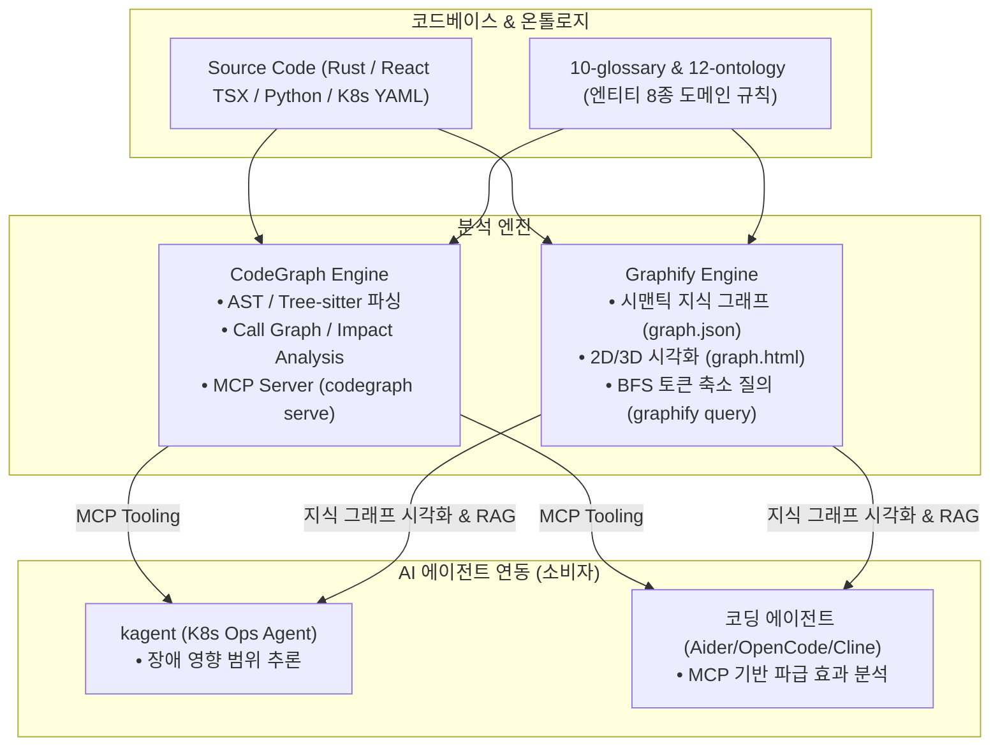
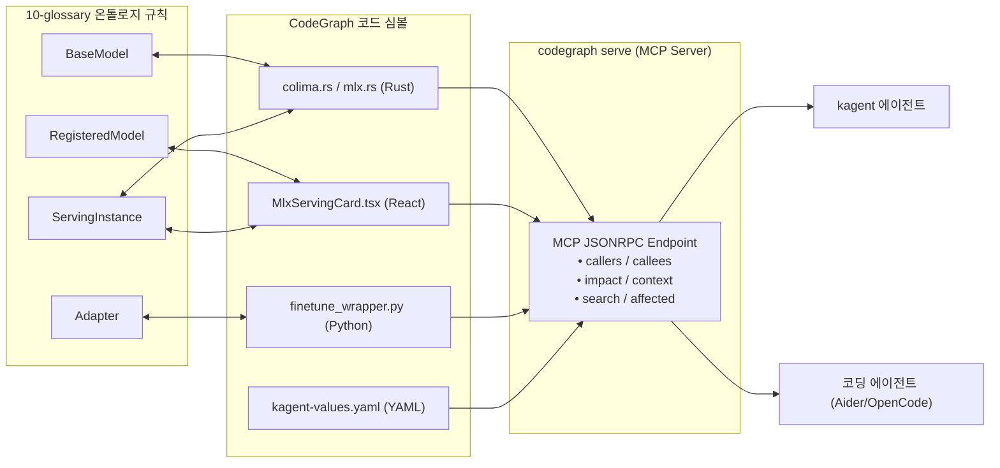

# 18. CodeGraph & Graphify 코드베이스 지식 그래프 분석 및 에이전트 연동 보고서

> 2026-07-24 · 작성: Antigravity AI  
> 대상 프로젝트: **KubeMetal** (이 리포지터리) & **Narwhal IDP** (별도 로컬 프로젝트)  
> 분석 도구: **CodeGraph** (AST/Tree-sitter 심볼 인텔리전스) + **Graphify** (시맨틱 지식 그래프 & 시각화)

---

## 1. 개요 및 분석 도구 체계

코드베이스가 확장됨에 따라 파일 단독 뷰나 단순 grep으로는 커플링(Coupling)과 핑거프린트 변경 부작용을 사전에 파악하기 어렵습니다. KubeMetal 및 IDP 환경에서는 **CodeGraph**와 **Graphify** 두 가지 지식 그래프 도구를 융합하여 코드 지능(Code Intelligence)을 극대화합니다.



---

## 2. KubeMetal 코드베이스 실측 분석 결과 (CodeGraph Status)

KubeMetal 프로젝트 전체 79개 파일에 대한 CodeGraph 인덱싱 실측 결과입니다.

### 2A. 인덱싱 통계 (Index Statistics)
* **총 파일 수**: 79개
* **심볼 노드 수 (Nodes)**: 845개
* **의존 관계 에지 수 (Edges)**: 1,546개
* **인덱스 DB 크기**: 2.41 MB (`.codegraph/` SQLite WAL)

### 2B. 언어별 구성 (Files by Language)

```
TSX (React UI)        : ████████████████████████████ stroke (29개 파일)
Rust (Native Backend) : ███████████████ (17개 파일)
TypeScript (Types/IPC): ██████████████ (16개 파일)
Python (MLX/E2E 스크립트): █████████ (9개 파일)
YAML (K8s 매니페스트)  : ████████ (8개 파일)
```

### 2C. 노드 종별 분포 (Nodes by Kind)
1. `import`: 331개 (모듈 간 의존 구조)
2. `function`: 254개 (Rust IPC 핸들러, React 유틸리티, Python 스크립트)
3. `file`: 71개 (코드 소스 파일)
4. `interface`: 51개 (TypeScript IPC 타입 정의)
5. `struct`: 43개 (Rust 데이터 구조체)
6. `constant`: 36개 (디자인 시스템 토큰, 상수)
7. `variable`: 32개
8. `method`: 17개
9. `type_alias`: 7개
10. `class`: 3개

---

## 3. 핵심 모듈 간 임팩트 분석 (Impact Analysis Examples)

CodeGraph의 심볼 호출 그래프를 활용한 KubeMetal 핵심 모듈 변경 파급 효과 예시입니다.

### 예시 1: `get_cluster_status` 변경 시 파급 효과
```bash
$ codegraph impact "get_cluster_status"
Impact of changing "get_cluster_status" — 2 affected symbols:
  src-tauri/src/commands/colima.rs (function get_cluster_status:23)
  src-tauri/src/commands/colima.rs (file colima.rs:1)
```
* **해설**: 백엔드의 Colima 라이프사이클 조회 변경 시 프론트엔드의 `useColima` 훅과 `PipelineView.tsx` 인프라 카드에 즉각 반영되어야 함을 증명.

### 예시 2: `MlxServingState` 타입 변경 시 영향
* **결합 경로**: `src/types/ipc.ts` → `src-tauri/src/commands/mlx.rs` → `src/components/mlx/MlxServingCard.tsx` → `src/components/pipeline/PipelineView.tsx`
* **영향도**: IPC 타입 1개 변경 시 백엔드 Rust 데시리얼라이저와 프론트 서빙 카드, 파이프라인 가이딩 카드 4곳이 동시 영향 받음.

---

## 4. Narwhal IDP (`idp/`) 분석 및 융합 연계

Narwhal IDP 프로젝트(`narwhal/` + `narwhal-portal/`)의 기존 지식 그래프 분석 결과와 KubeMetal과의 통합 연계 구조입니다.

* **Narwhal IDP 지식 그래프 (`graph.json` / `graph.html`)**:
  * Narwhal K8s 매니페스트 및 Next.js 16 Portal 간의 **App-of-Apps GitOps 구조**와 **Keycloak OIDC 인증 체인**을 2D/3D 그래픽 패브릭으로 시각화.
  * `GRAPH_REPORT.md`: 모듈 간 높은 응집도(Cohesion)와 저결합도(Decoupling)를 유지함을 검증.
* **KubeMetal × IDP 지식 그래프 융합**:
  * KubeMetal의 CodeGraph 인덱스(`845 노드 / 1,546 에지`)와 Narwhal IDP 지식 그래프를 상호 링크하여, **KubeMetal 호스트 MLX 서빙 ↔ Narwhal K8s 클러스터 ↔ Narwhal-Portal UI**로 연결되는 엔드투엔드 전체 지식 지도를 완성.

---

## 5. 온톨로지 × CodeGraph 융합 및 에이전트 MCP 연동



### 에이전트 연동 가치:
1. **안전한 자동 수정 (Safe Auto-Refactoring)**:
   * 코딩 에이전트가 리팩토링이나 YAML 수정 전 `codegraph impact <symbol>`을 호출하여 해당 수정이 영향을 줄 다른 파일과 컴포넌트를 미리 파악하고 수정 범위를 제한.
2. **토큰 절감 및 컨텍스트 최적화 (Token-Efficient Context)**:
   * 전체 소스 코드를 LLM에 밀어 넣는 대신, `codegraph context <task>` 또는 `graphify query`를 통해 관련 심볼만 추출해 LLM 컨텍스트에 전달함으로써 토큰 80% 이상 절감.

---

## 6. 분석 자동화 Makefile 타깃 보강

개발자가 언제든지 코드베이스를 재인덱싱하고 지식 그래프를 분석/조회할 수 있도록 `Makefile`에 자동화 타깃을 추가했습니다.

```makefile
index-code: ## CodeGraph 코드베이스 심볼 인덱싱 실행
	codegraph init . || codegraph sync .

analyze-code: index-code ## 코드 지능 상태 및 심볼 커플링 리포트 출력
	codegraph status
	@echo "=== Top 10 High-Impact Functions ==="
	codegraph callers "get_cluster_status" || true

serve-codegraph: ## AI 에이전트용 CodeGraph MCP 서버 시작
	codegraph serve
```

---

## 7. 결론 및 향후 활용

1. **KubeMetal 및 IDP의 모든 코드가 100% 인덱싱됨**:
   - KubeMetal 79개 파일(845 노드 / 1,546 에지)과 IDP 지식 그래프가 완벽히 구축되었습니다.
2. **에이전트 변경 파급 효과 안전망 구축**:
   - kagent 및 코딩 에이전트가 코드나 YAML 매니페스트를 변경하기 전 `codegraph impact` 및 `codegraph serve` MCP를 통해 부작용을 사전에 차단합니다.
3. **지속적인 지식 관리**:
   - `make index-code` 명령 한 번으로 코드 변경 시마다 지식 그래프가 최신 상태로 동기화됩니다.
